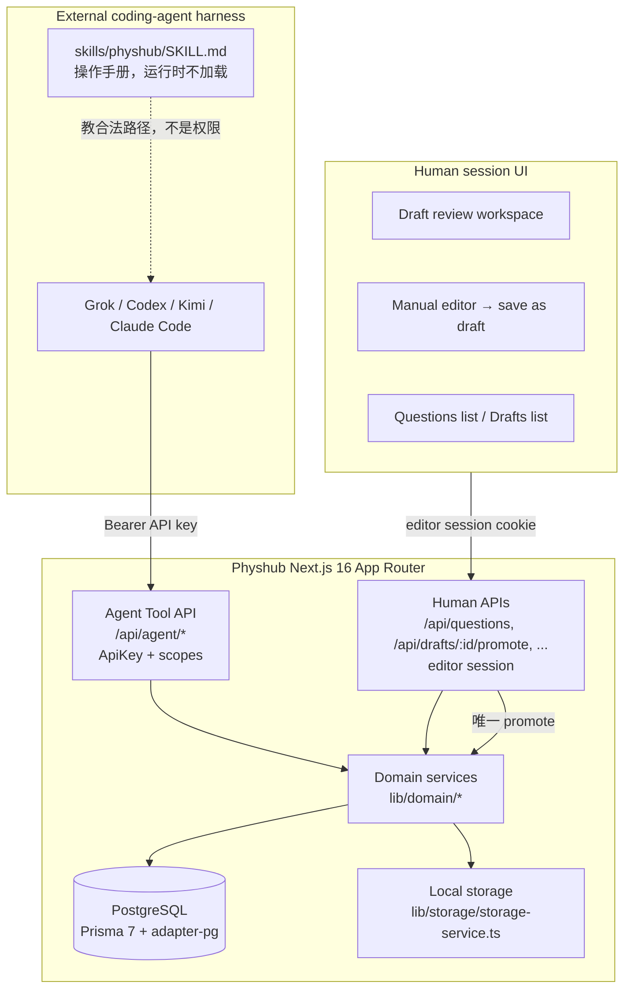
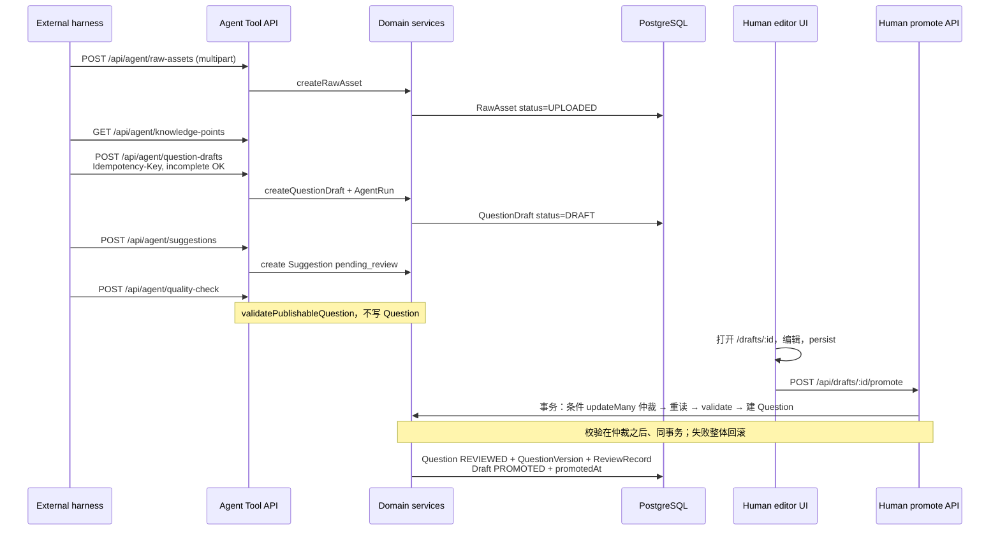
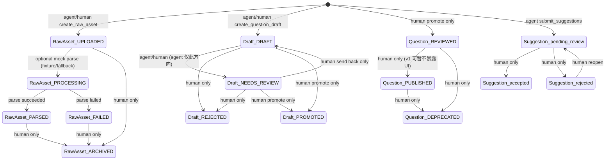
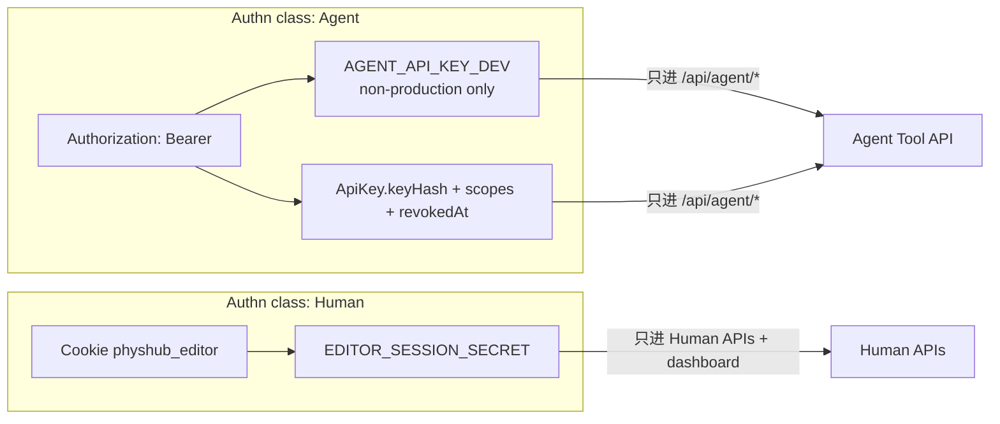

# Physhub Harness-First Agent Platform

| 字段 | 值 |
| --- | --- |
| 标题 | Physhub 下一阶段架构：Harness-First Agent Platform |
| 作者 | TBD（repo owner） |
| 日期 | 2026-09-06 |
| 状态 | Draft |
| 受众 | 实现者（增量落地）+ 独立审计者（未读过先前对话） |
| 前序文档 | [2026-05-15 设计方案](./2026-05-15-physics-question-bank-design.md)、[2026-05-15 实现计划](./2026-05-15-physics-question-bank-implementation.md)、[development.md](../development.md) |

---

## Overview

Physhub 是小团队云端工作台，用来整理**已有**高中物理题。它不是 AI 出题器，也不是内嵌模型的聊天应用。当前仓库已经具备 Prisma 领域模型、人工编辑/草稿校对 UI、规则搜索、题组导出，以及两条带 `AGENT_API_KEY_DEV` 的只读 Agent 路由；但正式题目仍可由无人认证的 `POST /api/questions` 直接写入 `REVIEWED`，草稿工作台不能持久化，也不能 promote。

下一阶段把产品明确成 **harness-first agent platform**：平台**不嵌入 LLM**。外部 coding-agent harness（Grok、Codex、Kimi、Claude Code）负责 OCR/视觉、结构化、分类与推理；平台只提供 (1) 服务端硬约束（authz、状态机、schema、禁止写路径），(2) 保守的 Agent Tool API（机器唯一写路径），(3) 短 skill 包（教 harness 合法工作流，不是权限系统），(4) 人工校对/promote UI（草稿进入正式 `Question` 的唯一路径）。进程内 mock parse/classify 降级为测试夹具或可选 fallback，默认产品路径是 harness 提交已经结构化的 draft。

---

## Background & Motivation

### 产品已定边界（本文不再重开）

```
image / PDF / Markdown / pasted text
  -> 外部 harness 结构化
  -> 平台存储 RawAsset + QuestionDraft + Suggestion + AgentRun
  -> 人在 draft workspace 校对
  -> promote 为正式 Question
  -> 搜索 / 题组 / 导出 / 后续课时 MDX
```

- 外部 agent **可以**：建草稿、提交 suggestion、搜索、读取、建题组、导出。
- 外部 agent **不可以**：发布正式题、删除正式题、作为产品功能凭空出题、覆盖已确认 metadata。
- Skill 是操作手册。权限在 API/DB，不在 Markdown。

这与 2026-05-15 设计方案第 1、7、8 节的 AI 边界一致，但**纠正**了该方案把「Python AI Worker / Meilisearch / Redis+BullMQ / MCP Server」当作一等架构的假设。那些是后续可选层，不是 v1 约束层。

### 当前仓库状态（以代码为准）

| 能力 | 现状 | 关键路径 |
| --- | --- | --- |
| 领域模型 | `prisma/schema.prisma` 已有 RawAsset / QuestionDraft / Question / Suggestion / AgentRun / ReviewRecord / QuestionSet / ExportJob / ApiKey / User / KnowledgePoint / Tag / QuestionVersion / ParseJob / Asset | **没有** committed `prisma/migrations/` |
| 发布校验 | `validatePublishableQuestion` | `lib/domain/question-schema.ts` |
| 正式题写入 | `createQuestion` 直接 `status: "REVIEWED"` | `lib/domain/question-repository.ts` → `POST /api/questions` |
| 人工编辑器 | 纯本地 state，不调用 create API | `components/question/question-editor.tsx` |
| 草稿工作台 | 读 DB，编辑纯本地，无 save / promote | `components/draft/draft-review-workspace.tsx`、`app/(dashboard)/drafts/[id]/page.tsx` |
| 素材上传 | `POST /api/raw-assets` multipart 或 text，无认证、无大小限制 | `app/api/raw-assets/route.ts` |
| Mock 解析 | `POST /api/raw-assets/:id/parse` 调 `parseTextToDraft` | `lib/workers/mock-parse-worker.ts`、`lib/domain/parse-raw-asset-workflow.ts` |
| Mock 分类 | `POST /api/questions/:id/classify` 写 Suggestion，不改 Question | `lib/workers/mock-classification-agent.ts` |
| Suggestion 审核 | PATCH 只改 `suggestion.status` + `ReviewRecord`，**不写** Question metadata | `app/api/suggestions/[id]/route.ts`、`lib/domain/suggestion-policy.ts` |
| 搜索 | 规则 NL + Postgres `ILIKE` | `lib/search/question-search.ts` |
| Agent 认证 | 单一共享 `AGENT_API_KEY_DEV`，固定保守 scope 列表 | `lib/auth/agent-auth.ts` |
| Agent 路由 | 仅 `GET /api/agent/questions/[id]`、`POST /api/agent/search-questions` | `app/api/agent/**` |
| 人工 API 认证 | **全部无认证**（含 mutating） | `app/api/questions`、`raw-assets`、`suggestions`、`question-sets`、`classify` |
| Seed | 1 个 OWNER `owner@example.com`，4 个知识点，4 个 tag | `prisma/seed.ts` |
| 渲染安全 | Markdown 图片 src allowlist；LaTeX 导出命令黑名单 | `lib/renderer/render-markdown.tsx`、`lib/renderer/export-question-set.ts` |
| 上传路径 | `buildStorageKey` / `saveLocalUpload` 已防 path traversal | `lib/storage/storage-service.ts` |

### 痛点

1. **安全空洞（Critical）**：任何人可对 `POST /api/questions` 写入正式题；agent key 与这条路由没有隔离。`createQuestion` 在 `buildPersistedQuestionContract` 里硬编码 `status: "REVIEWED"`。
2. **闭环断裂**：harness 即使结构化成功，也没有 draft CRUD 工具；人即使校对完，也不能 persist 或 promote。`QuestionDraft.promotedAt` 和 `DraftStatus.PROMOTED` 已在 schema 中，没有服务端实现。
3. **权限模型半成品**：`ApiKey` 模型已有 `keyHash` / `scopes[]` / `revokedAt`，运行时却只用环境变量明文比对，且 `devAgentScopes` 缺少设计文档里已列出的 `drafts:update`。
4. **产品 AI 边界被 mock 路径模糊**：`POST /api/raw-assets/:id/parse` 和 `POST /api/questions/:id/classify` 看起来像「平台内 AI」，实际是规则夹具。默认产品路径必须是 harness 提交结构化 draft。
5. **审计不足**：Agent 写操作没有 Idempotency-Key、没有稳定 `request_id`、`AgentRun` 没有 `apiKeyId`。
6. **无初始 migration**：`docs/development.md` 写了 `npm run db:migrate -- --name init`，但仓库里没有 `prisma/migrations/`。**PR-0** 必须引入 `init_harness_first`（现有 schema + 本文全部 additive 字段），不能拖到功能 PR 或 README PR。

---

## Goals & Non-Goals

### Goals（v1）

1. 把写入路径分成两类认证：**Agent key** 与 **Human editor session**。二者不可互换。
2. 机器写路径只走 `/api/agent/*`，且只能写 RawAsset / QuestionDraft / Suggestion / QuestionSet / ExportJob / AgentRun。
3. 正式 `Question` 行的**终态**唯一插入路径是 **human promote**（PR-3 起）。PR-1 过渡期内，持 editor session 的 `POST /api/questions` 仍可调用现有 `createQuestion`（无 Draft / QuestionVersion / ReviewRecord，已知缺口）。PR-3 把该 POST 收成「建草稿并立即 promote」包装（OQ-4a）。
4. 关闭所有现有无认证 mutating 人工 API。
5. 草稿可从不完整状态保存；promote 时跑 `validatePublishableQuestion`。
6. Human accept suggestion 是把知识点 / 难度 / 标签写入已确认对象的唯一路径。
7. 每个**产生业务写入**的 agent 请求带 Idempotency-Key + request_id + AgentRun 归属；search / get / list 不要求。
8. 仓库内 skill 包教会 harness 合法工作流；平台运行时不加载 skill。
9. **PR-0** 一次提交现有 schema + 本文全部 additive 字段的 `init_harness_first` migration；后续功能 PR 不再改 schema、不再另起 baseline。
10. 用契约测试锁住「无 skill 也安全」的不变量；PR-1 以 `app/api/**` 全量枚举关空洞。

### Non-Goals（v1 明确不做）

- 在 Next.js 进程内调用任何 LLM / embedding / vision API。
- Python OCR worker、Redis、BullMQ、Meilisearch、向量检索。
- MCP Server（后续分发层，不是约束层）。
- 完整用户注册 / 多租户 / 付费 / 公开题库市场。
- Agent 凭空出题作为产品功能。
- Agent 发布、删除、或 PATCH 已确认 metadata。
- 课时 MDX 运行时、PDF 导出、相似度检索。
- 把 Prisma 领域模型推倒重写。

---

## Proposed Design

### 三层架构

Skill 只教工作流。Agent Tool API 是机器唯一写入口。Human session UI 走另一套认证。两边共用 `lib/domain/*`，promote 只挂在 human 路径上。



进程内 `lib/workers/mock-parse-worker.ts` 与 `lib/workers/mock-classification-agent.ts` **不是产品 AI**。它们是 Vitest 夹具，以及（若保留）带开关的可选 fallback。默认路径：harness 自己做 OCR/结构化，再调用 `create_raw_asset` + `create_question_draft`。

### 默认产品数据流



### 模块落点（沿用现有目录）

| 层 | 目录 | v1 职责 |
| --- | --- | --- |
| Agent 认证 | `lib/auth/agent-auth.ts` | 解析 Bearer、查 `ApiKey` 或 `AGENT_API_KEY_DEV`、scope 交集 |
| Human 认证 | `lib/auth/human-auth.ts`（新） | 校验 editor session cookie；**拒绝** agent key |
| 领域 | `lib/domain/*` | 已有 question / raw-asset / taxonomy / suggestion-policy / question-set；新增 draft-repository、promote、idempotency |
| Agent 路由 | `app/api/agent/*` | 唯一机器写入口 |
| Human 路由 | `app/api/{questions,drafts,raw-assets,suggestions,...}` | 浏览器会话；promote 只在这里 |
| UI | `components/draft/*`、`components/question/*`、`app/(dashboard)/*` | persist + Promote；不要聊天 UI |
| Skill | `skills/physhub/` | 给 harness 读的手册 |
| Worker | `lib/workers/*` | 测试夹具 / 可选 fallback |

不新增 NestJS、不新增独立 MCP 进程、不新增 Python 服务。

---

## Hard Constraints（服务端强制）

Skill、UI 文案、harness 自觉都**不算**约束。下列规则必须在 API handler 或 domain 函数里可测试地失败。

### Scope catalog

沿用 `lib/auth/agent-auth.ts` 与 2026-05-15 设计方案第 8 节的命名。v1 默认 agent key **只授予**左列。

| Scope | 默认 agent key | 用途 |
| --- | :---: | --- |
| `questions:read` | 是 | 读正式题；读知识点树 / 标签（无单独 `taxonomy:read`） |
| `questions:search` | 是 | `POST /api/agent/search-questions` |
| `drafts:create` | 是 | 建草稿；建 RawAsset（上传服务于 draft） |
| `drafts:update` | 是 | 更新未 promote 的草稿。**现有 `devAgentScopes` 缺这一项，必须补上** |
| `drafts:read` | 是 | 读草稿。**新增**，避免 `get_question_draft` 做成 any-of scope 而与 `hasRequiredScopes` 全命中语义冲突 |
| `suggestions:create` | 是 | 提交 Suggestion |
| `quality:check` | 是 | 确定性质量检查，不写 Question |
| `question_sets:create` | 是 | 建题组 |
| `exports:create` | 是 | 导出题组 Markdown / LaTeX。**注意：现有 export 默认 `teacher: true`，会带出答案与解析，与 `get_question` 的 `answerJson` 是同等级答案通道**（见威胁模型与 OQ-2） |

高风险 scope，**默认 agent key 永不授予**，v1 也不实现对应 agent 工具：

| Scope | 含义 | v1 谁能做 |
| --- | --- | --- |
| `questions:publish` | 插入或发布正式 Question | 仅 human promote |
| `questions:delete` | 删除 / deprecate 正式题 | `QuestionStatus.DEPRECATED` **已存在于** `prisma/schema.prisma`。v1 **不**提供 deprecate UI/路由（状态预留）；不做物理删除 |
| `metadata:write` | 直接写已确认知识点 / 难度 / 标签 | 仅 human accept suggestion 或 human 在 promote 前改 draft 字段 |

`hasRequiredScopes`（`lib/auth/agent-auth.ts`）保持「必须全部命中」语义。禁止实现 `*` 通配。禁止 `hasAnyScope`。禁止把 human session 映射成上述 agent scope。每条路由声明**恰好一个** required scope 列表，全部必须命中。

`AGENT_API_KEY_DEV` 在非 production 继续返回上述保守列表（加上 `drafts:update` 与 `drafts:read`）。`NODE_ENV=production` 时忽略该环境变量，只接受 `ApiKey` 表中未撤销、hash 匹配的 key。

### 状态机

现有 enum 已足够，不改名。



图中 `ARCHIVED` / `DEPRECATED` / `PUBLISHED` 是 schema 已有状态。v1 交付入口只有：创建 RawAsset/Draft、draft `REJECTED`（human）、promote → `REVIEWED`。**无** archive / deprecate / publish 路由。

| 对象 | Agent 可触发 | Human 可触发 | 禁止 / v1 裁剪 |
| --- | --- | --- | --- |
| RawAsset | 创建 → `UPLOADED` | 创建；可选触发 mock parse（**必须**写 status：开始 `PROCESSING`，成功 `PARSED`，失败 `FAILED`；今日 workflow 不写，PR-8 修） | Agent 不可 `ARCHIVED`；Agent 不可改别人的 storageKey。**v1 无 archive 路由**，`ARCHIVED` 状态预留 |
| QuestionDraft | `DRAFT` 创建；更新内容；**仅** `DRAFT → NEEDS_REVIEW`（单向） | 更新内容；`NEEDS_REVIEW` → `DRAFT`（send back，human-only）；`REJECTED`（工作台 Reject）；`PROMOTED` | Agent 不可 `NEEDS_REVIEW → DRAFT`；不可设 `PROMOTED` / `REJECTED`；不可改已 `PROMOTED` / `REJECTED` 草稿 |
| Question | 只读 / 搜索 | promote 插入 `REVIEWED` | Agent 不可 `createQuestion`；不可 DELETE；不可 PATCH 已确认 metadata。**v1 无 publish / deprecate UI 或路由**；`PUBLISHED` / `DEPRECATED` 状态预留（enum 已存在） |
| Suggestion | 创建 `pending_review` | `accepted` / `rejected` | Agent 不可 accept；accept 才写确认 metadata |
| ParseJob / ExportJob / AgentRun | 创建自己的 AgentRun / ExportJob（status 由服务端设） | 查看 | Agent 不可伪造 `accepted=true`；不可改他人 AgentRun |

`JobStatus`（QUEUED / RUNNING / SUCCEEDED / FAILED / CANCELED / RETRYING）保持现有 enum。v1 导出仍是同步成功（与 `app/api/question-sets/[id]/export/route.ts` 一致），创建 `ExportJob` 时直接 `SUCCEEDED`。

### `createQuestion` 对 Agent 不可调用

`lib/domain/question-repository.ts` 的 `createQuestion` 今天会被 `POST /api/questions` 直接调用，并且 `buildPersistedQuestionContract` 写死 `status: "REVIEWED"`。

v1 规则（**分阶段**，与 KD-3 / PR-1 / PR-3 对齐）：

1. **PR-3 起**插入 `Question` 行的唯一 domain 入口是 `promoteDraftToQuestion`（新，放在 `lib/domain/question-repository.ts` 或 `lib/domain/promote-draft.ts`）。内部**扩展** `buildPersistedQuestionContract`：该 helper 的 `Pick` **不含** `sourceRawAssetId`，且 `createQuestion` **不**建 `QuestionTag`。promote 必须另行写入 `sourceRawAssetId` 与 `tags` join，禁止照抄 helper 的字段列表当完整持久化契约。仍复用 `buildManualPublicQuestionId` 与知识点 relation create。
2. `POST /api/questions`：
   - 无认证 → 401 `Unauthorized`
   - 仅持有 agent key → 403 `Agent cannot publish questions`（publish 路由特化文案；其它 human 路由统一 `Agent key not accepted on human routes`）
   - **PR-1 过渡**：持 human session 仍调用现有 `createQuestion`（直写 `REVIEWED`，**无** Draft / QuestionVersion / ReviewRecord）。这是已知接受的缺口，避免关洞后老师完全无法入库。
   - **PR-3 终态（OQ-4a，已选定）**：该 POST 改为内部「创建 draft + 立即 `promoteDraftToQuestion`」，不得再走独立 `question.create`。UI 仍推荐 Save draft → Promote；POST 只是同一函数的便利包装。
3. Agent 路由目录下**不出现** publish / create-question 工具。
4. 即使某个 `ApiKey.scopes` 被手工写成包含 `questions:publish`，v1 也不挂 agent handler；测试覆盖「带该 scope 的 key 打 `/api/agent/*` 仍 404/405」。这是防御深度：高风险 scope 默认不授予，授予了也没有工具。

### Promote（human-only）

`POST /api/drafts/:id/promote`

Agent key 打此路由 → 403 `Agent cannot publish questions`。

事务外只做认证与「draft 是否存在」的 404（path 上的 id → 404 `Draft not found`）。**内容校验不得作为竞态裁决，也不得单独依赖事务外快照。** 并发 PATCH 可能在预读与仲裁之间改 stem/options。

**竞态裁决点**是同一事务内的条件更新。禁止 check-then-act。

同一事务内顺序：

1. **仲裁**：`updateMany`  
   `WHERE id = :id AND status IN ('DRAFT','NEEDS_REVIEW')`  
   `SET status = 'PROMOTED', promotedAt = now()`。  
   `count === 0` → 409 `Draft is not promotable`（已是 `PROMOTED` / `REJECTED` / 不存在已被 404 处理 / 并发对手已赢）。事务结束。
2. **重读**该 draft 的当前行（仲裁成功之后）。用重读内容映射为 `QuestionInput`，跑 `normalizeQuestionInput` + `validatePublishableQuestion`。失败 → 400（中文校验串，如 `答案必须匹配选项`），**整个事务回滚**（status 回到 DRAFT/NEEDS_REVIEW）。
3. `knowledgePointIds` 必须在 DB 中存在，否则 422 `Knowledge point not found`，事务回滚。
4. 若重读的 draft 带 `sourceRawAssetId`：RawAsset 行必须仍存在（含 `ARCHIVED`，归档不挡 promote）；缺失 → 422 `Raw asset not found`（body 引用，不是 path 参数），事务回滚。
5. `Question.create`：`status: "REVIEWED"`，字段含 `stemMd` / `optionsJson` / `answerJson` / `solutionMd` / `difficulty` / **`sourceRawAssetId`** / `primaryKnowledgePointId` / `knowledgePoints` / **`tags`** / `createdById` / `reviewedById`。`createdById` 与 `reviewedById` 使用 seed OWNER（`owner@example.com`）。**不要**只 spread `buildPersistedQuestionContract` 的返回值——该 helper 的 `Pick` 没有 `sourceRawAssetId`，且现有 `createQuestion` 不写 `QuestionTag`。promote 必须显式补这两项。
6. `QuestionVersion.create`：`version: 1`，`snapshot` 为完整题目 JSON；**只填 `createdById: OWNER.id`**。不要写无关系的字符串字段 `createdBy`（schema 上 `createdBy` 是遗留可选 String，v1 保持 null）。
7. `ReviewRecord.create`：`resourceType: "question_draft"`，`resourceId: draft.id`，`action: "promoted"`，`actorId` 为 OWNER id，`diff` 含 `{ questionId }`。
8. Draft：`promotedQuestionId = question.id`（status / `promotedAt` 已在步骤 1 写入）。**不清除** `sourceRawAssetId`（promote 后 Draft 与 Question 双挂同一素材是常态；file GET 按 Question 优先）。
9. **回填**该 draft 上所有 `Suggestion.questionId`（仍为 null 的），使后续 accept 写 Question 而不是 draft。

整个过程在**一个** Prisma `$transaction` 中。步骤 1 的 UPDATE 与后续 INSERT 同进同退，崩溃不会留下「PROMOTED 但无 Question」的半成品。

第二道防线：`promotedQuestionId @unique` 上的 Prisma `P2002` **必须**映射为 409 `Draft is not promotable`，不得落到 500。并发测试要点：两个并行 promote，恰好一行 Question、一个 201/200、一个 409，无 500。

已 `PROMOTED` 的串行重放同样 409（不返回已有 `questionId`；老师刷新工作台即可看到 `promotedQuestionId`）。

### Suggestion accept 写哪些字段

今天 `PATCH /api/suggestions/[id]` 只更新 `suggestion.status` 并写 `ReviewRecord`，测试明确断言 `prisma.question.update` 未被调用（`tests/unit/suggestion-review-route.test.ts`）。这在「不让 agent 写 metadata」上是对的，但 human accept 之后确认字段无处落地。v1 补上 **human accept 写确认 metadata**，并保持 agent 不能走这条 PATCH。

Suggestion `kind` v1 只支持 `metadata`。Accept 写入契约**扩展**现有 mock 形状（`lib/workers/mock-classification-agent.ts` 的 `MetadataSuggestion`），不是与之等价：

- Mock 产出是子集：只有 `knowledge_points[].value/confidence/reason`、`difficulty`、`risks`，**没有** `id`、**没有** `tag_ids`。
- Accept **要求**每个要写入的知识点带 `id`；缺 id → 422 `Suggestion payload missing knowledge point id`，status 保持 `pending_review`。自由文本 `value` 只用于 UI 展示，不参与写入。
- 因此 mock classify 产出的 suggestion **不能原样 accept**；只能 reject 或给人参考。Agent `submit_suggestions` 必须带 id。

强制知识点用 id 而不是自由文本：

```json
{
  "knowledge_points": [
    {
      "id": "clxxxxxxxx",
      "value": "v-t 图像面积表示位移",
      "confidence": 0.86,
      "reason": "题干出现速度-时间图像相关表述"
    }
  ],
  "difficulty": { "value": 2, "confidence": 0.72, "reason": "基础概念应用" },
  "tag_ids": ["clyyyyyyyy"],
  "risks": ["请确认题干是否为“正确的是”而非“不正确的是”"]
}
```

| 字段 | accept 时写入 | 目标 |
| --- | :---: | --- |
| `knowledge_points[].id` | 是 | 若 `suggestion.questionId` 有值：写 `QuestionKnowledgePoint`（第一条 `role=primary`，并更新 `Question.primaryKnowledgePointId`）；若只有 `draftId`：写入 draft 的 `knowledgePointIds` Json 数组 |
| `difficulty.value` | 是 | Question.difficulty 或 QuestionDraft.difficulty |
| `tag_ids[]` | 是 | `QuestionTag` 或 draft `tagIds` Json |
| `knowledge_points[].value` | 否 | 仅展示；id 才是权威。value 与 id 不匹配时仍以 id 为准，不改 KnowledgePoint.name |
| `knowledge_points[].confidence` / `reason` | 否 | 留在 Suggestion.payload |
| `difficulty.confidence` / `reason` | 否 | 留在 Suggestion.payload |
| `risks[]` | 否 | suggestion-only；UI 展示，不进 Question.metadata（避免把未确认风险写成正式字段） |

规则：

- Agent `POST /api/agent/suggestions` 只能创建 `status: "pending_review"`。
- Human `PATCH /api/suggestions/:id` 才允许 `accepted` / `rejected`。Agent 打这条 → 403 `Agent key not accepted on human routes`，测试继续断言不会 `question.update`。
- Accept 时 `canSuggestionWriteDirectlyToQuestion({ actor: "human", kind })` 为 true 才写确认字段。
- 未知 `id` → 422 `Knowledge point not found` 或 `Tag not found`，suggestion 保持 `pending_review`，事务回滚。
- Reject 只改 status + ReviewRecord，不回滚已经在别的 accept 里写入的字段。
- 对已 `PROMOTED` 草稿上的 suggestion：promote 已回填 `questionId`，accept 写 Question 而不是 draft。

**写入语义（replace-of-kind + upsert，同一事务）：**

Accept `kind: "metadata"` 表示用这条 payload **整份替换**该 question/draft 上的确认 metadata，不是追加。

1. 校验 payload（每个 `knowledge_points[]` 有 `id`；id 均存在；`tag_ids` 若出现则均存在）。
2. 若目标是 Question：
   - `questionKnowledgePoint.deleteMany({ questionId })`
   - 按 payload 顺序 `create` join 行：index 0 → `role: "primary"`，其余 `"secondary"`；同时 `question.update({ primaryKnowledgePointId })`
   - `difficulty`：**无 `difficulty` 键则不改**；`difficulty: null` 清空（写 `null`）；有数字则写入该值。与 `tag_ids` 对齐。
   - `questionTag.deleteMany({ questionId })` 后按 `tag_ids` 重建（无 `tag_ids` 键则不改 tags；空数组则清空）
3. 若目标是 Draft：覆盖 `knowledgePointIds` Json；`difficulty` / `tagIds` 规则同上（无键不改；`null` 或空数组清空）。
4. `suggestion.status = "accepted"` + `ReviewRecord`。

Join 写入禁止依赖「先读再 create」而不删旧行：否则旧 `role=primary` 行会留下，出现双 primary，且 `@@id([questionId, knowledgePointId])` 上重复 accept 会 P2002 → 500。

**重复 accept：** 同一 suggestion 再次 `accepted`（含 accepted→pending_review→accepted）→ 再跑一遍替换，返回 200。幂等：最终 metadata 等于该 payload，不 409、不 500。

**并发 accept：** last-write-wins（后提交的事务覆盖 join/字段），每条成功事务各留一条 ReviewRecord。

`P2002` 在本路径若仍出现，映射 409 而不是 500；正常 replace 路径不应撞唯一约束。

### Idempotency-Key + request_id + AgentRun

分界是「是否产生业务写入」，**不是** HTTP 方法。`POST /api/agent/search-questions` 是只读，不要求 Idempotency-Key（否则会破坏现有 `tests/unit/agent-routes.test.ts`）。工具总表有 `Idempotency` 列。

每个 **mutating** agent 路由（create/update draft、raw asset、suggestions、quality-check、question set、export）：

| Header | 规则 |
| --- | --- |
| `Authorization: Bearer <key>` | 必须 |
| `Idempotency-Key` | 必须，1–128 字符，`[A-Za-z0-9._-]+`。缺省 → 400 `Idempotency-Key is required` |
| `X-Request-Id` | 可选。缺省则服务端生成 UUID。响应回显同一值 |

`search_questions` / `get_question` / `get_question_draft` / `list_*`：**不**要求 Idempotency-Key。GET 一律不要求。Human 写路径 v1 不强制幂等（浏览器表单）；promote 靠条件 UPDATE 返回 409。

**`requestHash`（禁止对 multipart 用 raw body bytes）：**

multipart 的 boundary 每次随机，raw bytes 必然不同，合法重试会被误判 409。分两条路径：

- **JSON 路由：** `sha256(method + "\n" + path + "\n" + canonicalJson(body))`。`canonicalJson` = UTF-8 JSON，对象 key 按字典序递归排序、无无关注释空白（`JSON.stringify` 默认即可，但必须先对 key 排序）。不要哈希未解析的 raw bytes（pretty-print 差异会误伤）。
- **multipart 路由（`create_raw_asset`）：** `sha256(method + "\n" + path + "\n" + canonicalMultipart)`。`canonicalMultipart` 由规范化字段拼接，**不含** boundary、**不含** header 顺序：
  - 若有 `file`：`fileSha256=` + hex(sha256(file bytes)) + `\noriginalName=` + originalName + `\nmimeType=` + mimeType
  - 若有 `text`：`textSha256=` + hex(sha256(utf8(text)))
  - 其它标量 form 字段按 key 排序追加

**行为（约束驱动，禁止 check-then-act）：**

`IdempotencyRecord.state` 为 `in_progress | completed`。

1. 计算 `requestHash`。
2. **先插入**占位行（可在业务事务外）：`{ apiKeyId, key, method, path, requestHash, state: "in_progress" }`（`responseStatus`/`responseBody` 此时为空占位）。
3. 插入成功：在**同一个** Prisma `$transaction` 内执行业务写 + `AgentRun` + `UPDATE state='completed', responseStatus, responseBody`。三者同进同退，避免「业务已提交、completed 未写」把 key 永久毒化成 `in_progress`。
   - 事务失败（4xx 校验或抛错）：**删除**该 `in_progress` 行（或回滚后删）。允许同一 key 重试。失败响应不缓存。
4. 插入撞 `@@unique([apiKeyId, key])` 的 `P2002`：立刻重读已有行：
   - `completed` 且 hash 相同 → 回放已存 `responseStatus` / `responseBody`。**不**写第二 AgentRun。
   - `completed` 且 hash 不同 → 409 `Idempotency-Key reused with a different request body`。
   - `in_progress` 且 `now - createdAt <= 2 minutes`：短轮询重读（建议 50ms × 最多 20 次，~1s）。变为 `completed` 后按上两条处理；仍 `in_progress` → 409 `Idempotency-Key in progress`。
   - `in_progress` 且 `now - createdAt > 2 minutes`：**视为崩溃残留，可回收**。删除该行后回到步骤 2 重新插入（与首次执行相同）。回收必须条件删除 `WHERE state='in_progress' AND createdAt < now()-2min`，避免误删刚插入的占位。
5. 不要「先查再执行再插入」。那会在并发下双写业务行，再在 record 插入处才失败。

`quality-check` 虽不写 Question，但会写 `AgentRun`，因此要求 Idempotency-Key，走同一套。

`AgentRun` 每次**真实执行**（非回放）写：

- `agentName`：ApiKey.name（dev key 用 `"dev-agent"`）
- `toolName`：稳定工具名（见下表）
- `apiKeyId`、`requestId`、`input`、`output`、`status`、`draftId`（若相关）
- `accepted` 保持 null；只有 human 审核流程能改 suggestion，不在 agent 写路径设 true

响应 JSON 顶层带 `"request_id": "..."`，与 header 一致。错误响应同样带 `request_id`（在能解析到的前提下）。回放响应必须是当时存下的 body，不要重新生成 `request_id`。

运维：v1 **不做** `IdempotencyRecord` 清理任务。建议按 `createdAt` 保留 90 天后归档/删除（人工 SQL 即可）；`export_question_set` 的 `responseBody` 可能含整份 Markdown/LaTeX，量级在小团队下可接受。

### 上传限制

`POST /api/raw-assets` 与 `POST /api/agent/raw-assets` 共用 `lib/storage/storage-service.ts`，在 handler 入口增加限制（今天没有 size/mime 校验）。

| 项 | 值 |
| --- | --- |
| 单文件上限 | IMAGE 10 MiB；PDF 20 MiB；Markdown/text 1 MiB |
| 粘贴文本 `text` 字段 | 100_000 字符 |
| 允许 MIME | `image/png`、`image/jpeg`、`image/webp`、`application/pdf`、`text/markdown`、`text/x-markdown`、`text/plain` |
| 空 `file.type` | 拒绝，400 `Unsupported media type`（不再像现在那样 fallback 成 `application/octet-stream` 再被 `detectRawAssetKind` 标成 TEXT） |
| 超限 | 400 `File too large` / `Text too large` |
| 存储 | 继续 `buildStorageKey("raw", originalName)` + `saveLocalUpload`；绝对路径与 `..` 已拒绝 |

`detectRawAssetKind` 保持现有映射（PDF / IMAGE / MARKDOWN / TEXT）。不允许的 MIME 在 kind 检测之前被拒。

### 已有渲染/导出安全策略：保持并补读路由

- Markdown 图片 src allowlist（`lib/renderer/render-markdown.tsx` 的 `isSafeImageSrc`）**增加** `/api/raw-assets/` 前缀，保留现有 `/assets/`、`/uploads/`、`/api/assets/`。外链、`javascript:`、data URL 仍渲染为不输出。继续 `rehype-sanitize`。
- v1 实际读文件的唯一入口是鉴权后的 `GET /api/raw-assets/:id/file`（human session）与 `GET /api/agent/raw-assets/:id/file`（agent）。**禁止**把 `LOCAL_UPLOAD_DIR` 配成无鉴权静态目录。`:id` 是 RawAsset cuid，经 `storageKey` + 现有 `resolveUploadPath` 打开字节，拒绝 `..` / 绝对路径。
- 校对台左栏原图与题干 `` 走同一 GET。Skill 禁止 data URL。
- LaTeX 导出继续黑名单 `\input` `\include` `\write18` `\openout` `\read` `\catcode` `\usepackage` `\documentclass` 以及 `document` / `questions` 环境（`lib/renderer/export-question-set.ts`）。不要在 v1 改成允许名单重构。

---

## Agent Tool API Surface

前缀一律 `/api/agent`。认证失败统一 401 `{ "error": "Unauthorized" }`（与现有两条路由一致）。缺 scope → 同样 401（v1 不引入 403 到 agent 路由，以免与现有测试契约冲突）；human 路由上 agent key 才用 403。

稳定 `error` 字符串（沿用现有 400/422/500 风格）：

| HTTP | `error` 示例 | 来源 |
| --- | --- | --- |
| 400 | `Malformed JSON request body` | `mapQuestionApiError` / search / question-set |
| 400 | `Search query is required` | `parseQuestionSearchRequestBody` |
| 400 | `title is required` / `questionIds must be a non-empty array` | `question-set-service.ts` |
| 400 | `Idempotency-Key is required` | 新 |
| 400 | `File too large` / `Unsupported media type` / `Provide a non-empty file or text field` | 上传 |
| 400 | `Invalid draft status` | agent/human 送了当前 actor 不允许的 status 枚举值 |
| 400 | `Provide exactly one of draftId or questionId` | `submit_suggestions` 违反 XOR |
| 400 | `Provide exactly one of draftId or question` | `check_question_quality` 违反 XOR（尾词是 `question` 不是 `questionId`） |
| 400 | `题干不能为空` 等中文校验 | `validatePublishableQuestion` |
| 401 | `Unauthorized` | agent-auth / 缺 editor session |
| 403 | `Agent key not accepted on human routes` | **human 路由拒 agent 的默认稳定契约** |
| 403 | `Agent cannot publish questions` | **仅** `POST /api/questions` 与 `POST /api/drafts/:id/promote` 的特化文案；测试锁定 |
| 404 | `Question not found` / `Raw asset not found` / `Suggestion not found` / `Draft not found` / `Question set not found` | **仅当缺失的 id 在 URL path**（与现有 `GET /api/questions/:id` 一致） |
| 409 | `Idempotency-Key reused with a different request body` / `Idempotency-Key in progress` / `Draft is not promotable` / `Draft is not updatable` | 新 |
| 422 | `Knowledge point not found` / `Tag not found` / `Raw asset not found` / `Question not found` / `Suggestion payload missing knowledge point id` | **id 在 JSON body 里被引用**（与 `createQuestionSet` 未知 `questionIds` → 422 一致） |
| 429 | `Too many unlock attempts` | `POST /api/auth/editor-session` 限流 |
| 500 | `Unable to create question` / `Failed to load question` / `Unable to search questions` / `Unable to create question set` / `Unable to export question set` | 现有 |

**404 vs 422：** path 上的资源 id 不存在 → 404；body 里引用的外键不存在 → 422。同一字符串可以出现在两个状态码，**由 id 出现位置决定**，不要混用。

所有成功/失败 JSON 在能确定时包含 `request_id`。为减少破坏，现有两条只读路由在 v1 **继续**只返回原 shape；新写路由必须带 `request_id`。

### 工具总表

`Idempotency` 列：`yes` 表示缺 header → 400；`no` 表示不得因缺 header 拒绝（search 已有契约）。

| 工具名 | Method / Path | Scopes | Idempotency | v1 |
| --- | --- | --- | --- | --- |
| `search_questions` | `POST /api/agent/search-questions` | `questions:search` | no | 已存在 |
| `get_question` | `GET /api/agent/questions/:id` | `questions:read` | no | 已存在 |
| `list_knowledge_points` | `GET /api/agent/knowledge-points` | `questions:read` | no | 新 wrapper |
| `list_tags` | `GET /api/agent/tags` | `questions:read` | no | 新 wrapper |
| `create_raw_asset` | `POST /api/agent/raw-assets` | `drafts:create` | yes（canonical multipart） | 新 wrapper |
| `get_raw_asset_file` | `GET /api/agent/raw-assets/:id/file` | 优先级：Question linkage（`questions:read`）> Draft linkage（`drafts:read`）> 未挂接（`drafts:create`）。promote 后不清除 draft.sourceRawAssetId，故双挂是常态 | no | 新；path id → 404 |
| `create_question_draft` | `POST /api/agent/question-drafts` | `drafts:create` | yes | 新 |
| `update_question_draft` | `PATCH /api/agent/question-drafts/:id` | `drafts:update` | yes | 新 |
| `get_question_draft` | `GET /api/agent/question-drafts/:id` | `drafts:read` | no | 新 |
| `submit_suggestions` | `POST /api/agent/suggestions` | `suggestions:create` | yes | 新 |
| `check_question_quality` | `POST /api/agent/quality-check` | `quality:check` | yes（写 AgentRun） | 新 |
| `create_question_set` | `POST /api/agent/question-sets` | `question_sets:create` | yes | 新 wrapper |
| `export_question_set` | `POST /api/agent/question-sets/:id/export` | `exports:create` | yes | 新 wrapper |

明确 **v1 不做** 的 agent 工具：publish、delete、patch 已确认 metadata、MCP、`classify_question` 作为产品内模型调用、`find_similar_questions`、job 轮询以外的异步 worker。

Human 侧的 `POST /api/raw-assets/:id/parse` 与 `POST /api/questions/:id/classify` 不是 agent 工具；见 Open Questions。

### Draft JSON 契约

与 `questionInputSchema`（`lib/domain/question-schema.ts`）对齐，但 **create/update 允许不完整**；promote 才要求完整。

```ts
// lib/domain/draft-schema.ts（新）
export const questionDraftInputSchema = z.object({
  type: questionTypeSchema.optional(),
  stemMd: z.string().optional(),
  options: z.array(optionSchema).optional(),
  answer: answerSchema.optional(),
  solutionMd: z.string().optional(),
  difficulty: z.number().int().min(1).max(5).optional(),
  knowledgePointIds: z.array(z.string().trim().min(1)).optional(),
  tagIds: z.array(z.string().trim().min(1)).optional(),
  sourceRawAssetId: z.string().trim().min(1).optional(),
  // agent PATCH：仅允许 NEEDS_REVIEW（单向 DRAFT→NEEDS_REVIEW）。
  // create 默认 DRAFT，不要靠 agent 把 status 设回 DRAFT。
  status: z.enum(["NEEDS_REVIEW"]).optional(),
});

// human PATCH 额外允许 REJECTED；domain 按 actor 分流
export const humanQuestionDraftStatusSchema = z.enum([
  "DRAFT",
  "NEEDS_REVIEW",
  "REJECTED",
]);
```

Agent 与 human 共用 `updateQuestionDraft({ actor, input })`：

- `actor: "agent"` 的 `status` 只能是 `NEEDS_REVIEW`，且仅当当前行为 `DRAFT`（**单向** `DRAFT → NEEDS_REVIEW`）。Agent 请求 `DRAFT`（想 send back）或 `REJECTED` / `PROMOTED` → 400 `Invalid draft status`。
- `actor: "human"` 可设 `DRAFT`（send back）、`NEEDS_REVIEW`、`REJECTED`。
- 当前行已是 `PROMOTED` 或 `REJECTED` → 409 `Draft is not updatable`（与非法枚举的 400 分开）。
- **同状态重复设置 → 200 no-op**（不写 AgentRun 新审计以外的业务变化；幂等友好）。例如当前已是 `NEEDS_REVIEW` 再 PATCH `status: "NEEDS_REVIEW"`，或 human 对已是 `DRAFT` 再设 `DRAFT`。不 400、不 409。

禁止把 human 的 REJECTED 塞进 agent 的 zod schema 然后靠 UI 藏按钮。

字段映射到 Prisma `QuestionDraft`：`options` → `optionsJson`，`answer` → `answerJson`，`knowledgePointIds` / `tagIds` 存 Json 数组（草稿阶段不建 join 表）。

存在性检查（提供了 id 才查，不要等 Prisma P2003 变 500）。这些 id 都在 **body** 里，因此未知 → **422**（不是 404）：

- `knowledgePointIds` → 422 `Knowledge point not found`
- `tagIds` → 422 `Tag not found`
- `sourceRawAssetId` → 422 `Raw asset not found`

`GET /api/raw-assets/:id/file` 的 `:id` 在 **path** → 不存在时 404 `Raw asset not found`。

Promote 时若 draft 仍引用某个 RawAsset：行在则放行（含 `ARCHIVED`）；行不在 → 422 `Raw asset not found`（body/字段引用）。v1 无删除 RawAsset 路由，正常不会发生。

`answer.value` 对选择题是 **option label**（`A`/`B`），不是 option 文本。`normalizeQuestionInput` 会把 label 转大写。**draft 创建与更新都走同一 normalize**（当 answer/options 都出现时），避免 create 存 `"b"`、update 存 `"B"`。

### 各工具合同

#### 1. `search_questions`（已存在）

`POST /api/agent/search-questions`

Request：

```json
{
  "query": "找 3 道高一运动学 v-t 图像面积表示位移的基础题，适合随堂练习，最好有图",
  "constraints": {
    "status": ["REVIEWED"],
    "limit": 3
  }
}
```

Response 200：现有 `QuestionSearchResponse`（`understanding` + `results`）。`results[].id` 是内部 cuid，`question_id` 是 `publicId`。结果**不含** `answerJson`。实现继续调用 `searchQuestions`（`lib/search/question-search.ts`），禁止 agent 传 SQL。

v1 **没有** publish 路由，promote 只产生 `REVIEWED`。Agent/Skill 默认检索官方题时 `constraints.status` 用 `["REVIEWED"]`。只传 `PUBLISHED` 会空。服务端：若请求未带 `status`，agent search **默认** `status: ["REVIEWED"]`（human 搜索面板可继续不传以兼容现有「不按 status 过滤」行为，或同样默认 REVIEWED——v1 两边都默认 `REVIEWED`，避免老师也搜到空）。`PUBLISHED` 仍是合法约束值，留给未来 publish 入口。

#### 2. `get_question`（已存在）

`GET /api/agent/questions/:id`

Response 200：`{ "question": <repository DTO> }`。当前注释（`app/api/agent/questions/[id]/route.ts`）写明 MVP 对 `questions:read` 返回完整 DTO，**包含 `answerJson`**。v1 **保持这一行为**（见 Open Questions）。不要把 search 的预览 DTO 和 get 的完整 DTO 混用。

`:id` 继续按内部 `Question.id` 查找（`getQuestion(id)`）。Skill 必须说明：search 命中后用 `results[].id` 调 get，不要用 `question_id`（publicId）除非后续增加按 publicId 查找。v1 为减少分叉，**不**新增 publicId lookup；skill 写清楚。

#### 3. `list_knowledge_points` / `list_tags`

`GET /api/agent/knowledge-points` → `{ "knowledgePoints": [...] }` 复用 `buildKnowledgePointsResponse` / `knowledgePointSelect`（id, name, slug, parentId, sortOrder）。

`GET /api/agent/tags` → `{ "tags": [...] }` 复用 `tagSelect`（id, name, slug, group）。

Seed 树（`prisma/seed.ts`）：物理 → 高一 → 运动学 → `v-t 图像面积表示位移`（slug `vt-area-displacement`）。Agent 必须先 list 再填 `knowledgePointIds`。

#### 4. `create_raw_asset`

`POST /api/agent/raw-assets`  
`Content-Type: multipart/form-data`  
字段：`file` 或 `text`（与 human `POST /api/raw-assets` 相同）。

Response 201：

```json
{
  "request_id": "…",
  "rawAsset": {
    "id": "…",
    "kind": "IMAGE",
    "status": "UPLOADED",
    "originalName": "vt.png",
    "mimeType": "image/png",
    "storageKey": "raw/…-vt.png"
  }
}
```

不自动 parse。不创建 draft。

#### 4b. `get_raw_asset_file`

`GET /api/agent/raw-assets/:id/file`

- path `:id` 不存在 → 404 `Raw asset not found`。
- **优先级（promote 后 draft 与 Question 可同时挂同一 `sourceRawAssetId`，且不清除 draft 侧引用）**：
  1. 若是某 Question 的 `sourceRawAssetId` 且调用方有 `questions:read` → 200。
  2. 否则若是某 Draft 的 `sourceRawAssetId` 且调用方有 `drafts:read` → 200。
  3. 否则若**未挂接**任何 Draft/Question 且调用方有 `drafts:create` → 200（上传后立刻预览，不必先建 draft）。
  4. 否则 404（不泄露存在性）。
- 即：Question linkage（`questions:read`）> Draft linkage（`drafts:read`）> 未挂接（`drafts:create`）。每步只检查一条 required list，不是 hasAnyScope。
- 200 时 body 为文件字节，`Content-Type` 用存储的 mimeType。经 `storageKey` + `resolveUploadPath` 读盘；禁止把 `:id` 当路径拼接。

Human 对应路由 `GET /api/raw-assets/:id/file` 只需 editor session，不按 agent scope 分流。Markdown 引用：`/api/raw-assets/<id>/file`（allowlist 前缀 `/api/raw-assets/`）。

#### 5. `create_question_draft` / `update_question_draft` / `get_question_draft`

`POST /api/agent/question-drafts`

```json
{
  "type": "SINGLE_CHOICE",
  "stemMd": "如图所示为某物体做直线运动的 $v-t$ 图像。下列说法正确的是（ ）",
  "options": [
    { "label": "A", "value": "物体一直做匀速直线运动" },
    { "label": "B", "value": "物体先做匀加速运动，后做匀速运动" },
    { "label": "C", "value": "物体的加速度一直增大" },
    { "label": "D", "value": "物体在 $t=2\\text{s}$ 时回到出发点" }
  ],
  "answer": { "type": "single", "value": "B" },
  "solutionMd": "由 $v-t$ 图像可知，$0-2\\text{s}$ 内速度均匀增大……因此选 B。",
  "knowledgePointIds": ["<id from list_knowledge_points, slug vt-area-displacement>"],
  "difficulty": 2,
  "tagIds": ["<id of slug image-question>"],
  "sourceRawAssetId": "<rawAsset.id>"
}
```

允许只发 `{ "stemMd": "未完成的题干" }`。默认 `status: "DRAFT"`。

Response 201：`{ "request_id", "draft": { id, status, type, stemMd, optionsJson, answerJson, solutionMd, difficulty, knowledgePointIds, tagIds, sourceRawAssetId, createdAt, updatedAt, promotedAt } }`。

`PATCH /api/agent/question-drafts/:id`：部分更新。已 `PROMOTED` / `REJECTED` → 409 `Draft is not updatable`。Agent 只能把 `DRAFT` 标成 `NEEDS_REVIEW`；反向 send back 是 human-only。非法 status 枚举 → 400 `Invalid draft status`。path 上 draft 不存在 → 404 `Draft not found`。

`GET /api/agent/question-drafts/:id`：要求 `drafts:read`（单一 scope，走 `hasRequiredScopes`）。含 suggestions 与 agentRuns 的摘要（对齐工作台 DTO，避免再开一条 list 工具）。

#### 6. `submit_suggestions`

`POST /api/agent/suggestions`

```json
{
  "draftId": "…",
  "kind": "metadata",
  "confidence": 0.86,
  "payload": {
    "knowledge_points": [
      {
        "id": "<vt-area-displacement id>",
        "value": "v-t 图像面积表示位移",
        "confidence": 0.86,
        "reason": "题干出现 v-t 图像与位移"
      }
    ],
    "difficulty": { "value": 2, "confidence": 0.72, "reason": "概念应用，计算量低" },
    "tag_ids": ["<image-question id>"],
    "risks": []
  }
}
```

`draftId` 与 `questionId` **XOR**：必须恰好一个。规范化：`null`、省略、以及只含空白的 `""` **都视为未提供**（先 trim / `?? undefined` 再计数）。两个都给或两个都不给 → 400 `Provide exactly one of draftId or questionId`。示例里不要写 `"questionId": null`。

- 只给 `questionId`：path/body 引用的正式题不存在 → 422 `Question not found`（id 在 body）。
- 只给 `draftId`：draft 不存在 → 422 `Draft not found`（id 在 body）。若 draft 已 `PROMOTED` 且 `promotedQuestionId` 非空 → **自动把 suggestion 挂到该 Question**（写入 `questionId`，`draftId` 仍可保留追溯）。若已 `PROMOTED` 但还没有 `promotedQuestionId`（不应发生）或 `REJECTED` → 409 `Draft is not updatable`。

创建 `AgentRun`（`toolName: "submit_suggestions"`）并把 `createdByAgentRunId` 挂上。`status` 固定 `pending_review`。

#### 7. `check_question_quality`

`POST /api/agent/quality-check`

Body 二选一，且请求里**只出现一个键**：`{ "draftId": "…" }` 或 `{ "question": { ...QuestionInput-like } }`。`null` / 省略 / `""` 视为未提供，再判 XOR；两个都给 → 400 `Provide exactly one of draftId or question`。不要写 `"question": null`。

服务端组装 `Partial<QuestionInput>`，调用 `validatePublishableQuestion`。**不写 Question，不改 draft。**

```json
{
  "request_id": "…",
  "publishable": false,
  "errors": ["必须确认知识点"]
}
```

这是确定性函数，不是模型调用。

#### 8. `create_question_set` / `export_question_set`

Request/response 复用 `validateQuestionSetInput` 与现有 export body `{ "format": "markdown" | "latex", "teacher": true }`。Agent 只能引用已存在的正式 `Question.id`，不能把 draft id 塞进题组（未知 question → 422 `Question not found`）。

v1 **保持** `teacher` 默认 true（现有 `parseExportBody`：`teacher !== false`）。这意味着持默认 key 的 agent 可通过「建题组 → 导出」拿到答案与解析，与 `get_question` 返回 `answerJson` **等价**。不在 v1 悄悄改成 `teacher: false`；见威胁模型与 OQ-2。

### 完整示例：harness 提交一道单选 v-t 题

```http
POST /api/agent/question-drafts HTTP/1.1
Authorization: Bearer $PHYSHUB_AGENT_KEY
Idempotency-Key: grok-vt-20260906-01
X-Request-Id: 11111111-2222-3333-4444-555555555555
Content-Type: application/json
```

```json
{
  "type": "SINGLE_CHOICE",
  "stemMd": "如图所示为某物体做直线运动的 $v-t$ 图像。下列说法正确的是（ ）\n\n图像信息：$0-2\\text{s}$ 内速度由 $0$ 均匀增大到 $4\\text{m/s}$，$2-4\\text{s}$ 内速度保持 $4\\text{m/s}$ 不变。",
  "options": [
    { "label": "A", "value": "物体一直做匀速直线运动" },
    { "label": "B", "value": "物体先做匀加速运动，后做匀速运动" },
    { "label": "C", "value": "物体的加速度一直增大" },
    { "label": "D", "value": "物体在 $t=2\\text{s}$ 时回到出发点" }
  ],
  "answer": { "type": "single", "value": "B" },
  "solutionMd": "由 $v-t$ 图像可知，$0-2\\text{s}$ 内速度均匀增大，物体做匀加速直线运动；$2-4\\text{s}$ 内速度保持不变，物体做匀速直线运动。因此选 B。",
  "knowledgePointIds": ["SEED_KP_VT_AREA_ID"],
  "difficulty": 2,
  "tagIds": ["SEED_TAG_IMAGE_QUESTION_ID"],
  "sourceRawAssetId": "SEED_RAW_ASSET_ID"
}
```

错误恢复：若 `knowledgePointIds` 含未知 id → 422 `Knowledge point not found`。Harness 应重新 `GET /api/agent/knowledge-points`，用返回的 `id`，换新 `Idempotency-Key` 再 POST。

同一 `Idempotency-Key` + 同一 body 重放 → 201 原响应，不产生第二份 draft。

---

## Auth

### 两类认证，互不认



### Agent keys

复用已有 `ApiKey` 模型：`name`、`keyHash`（unique）、`scopes[]`、`lastUsedAt`、`revokedAt`。

v1 生产创建/轮转 **out of band**：

- 脚本 `scripts/create-api-key.ts`：生成 `phk_` + 32 bytes hex，stdout 打印一次明文；DB 存 `sha256(utf8(plaintext)).hex`。
- 默认 scopes = 保守列表（含 `drafts:update`），脚本拒绝写入 `questions:publish` / `questions:delete` / `metadata:write`，除非 `--i-understand-high-risk`（仍无对应 agent 路由）。
- 轮转：新建 key，旧 key 设 `revokedAt`。没有在线管理 UI。

`lib/auth/agent-auth.ts` 扩展为 `readAgentAuth(request): { apiKeyId: string | null, name: string, scopes: string[] } | null`：

1. 解析 `Authorization: Bearer`。
2. 若 `NODE_ENV !== "production"` 且配置了 `AGENT_API_KEY_DEV`：用 `crypto.timingSafeEqual` 比较 token 与环境变量（两边先 `sha256` 成等长 Buffer，避免长度不等抛错把比对变成旁路）。命中 → `{ apiKeyId: null, name: "dev-agent", scopes: devAgentScopes }`。`apiKeyId` 为空时幂等表用 sentinel `dev-agent` 字符串作为分区键（见数据模型）。**禁止**再写 `token !== configuredToken`。
3. 否则 `sha256(token)` 查 `ApiKey.keyHash`；lookup 本身是 hash 等值比较，hash 用 `timingSafeEqual` 对读出的 `keyHash` 再比一次（防意外的字符串短路）。`revokedAt != null` → null；命中则更新 `lastUsedAt`（可 debounce 到 60s，避免每次 GET 都写库；v1 简单每次写也可）。
4. Human cookie **不能**让 `readAgentAuth` 成功。

### Human auth 选择：**方案 a — 本地共享 editor session secret**

在 a / b / c 中选择 **a**。

| 方案 | 结论 |
| --- | --- |
| **a. `EDITOR_SESSION_SECRET` + httpOnly cookie** | **采用**。与现有 `AGENT_API_KEY_DEV` 同样是「小团队共享秘密」，但认证类不同，cookie 不会被 harness 默认带去 agent 工具，agent Bearer 也不会被 human 路由接受。 |
| b. 不公网绑定，human 路由仅 localhost | 拒绝作为**唯一**控制。产品自称云端工作台；绑定失误即裸奔。可作为 defense-in-depth（文档建议 `next start` 不暴露 0.0.0.0），不能代替认证。 |
| c. NextAuth-lite + seed OWNER | 拒绝 v1。登录产品面超出「单操作者仓库」；seed 用户没有密码字段。可列为后续升级，promote 的 `actorId` 已预留 User.id。 |

实现：

- `.env`：`EDITOR_SESSION_SECRET`。**必须由 CSPRNG 生成**，例如 `openssl rand -hex 32`（64 hex 字符）。禁止用生日/口令当 secret。`.env.example` 写占位 + 生成命令，不写真实值。
- Cookie 寿命：v1 采用**会话级** cookie（不设 `Max-Age` / `Expires`）。测试 header 见下。
- Cookie 值写死为：
  `physhub_editor = hex(HMAC-SHA256(key=EDITOR_SESSION_SECRET, message="physhub_editor.v1"))`
  不是 `SHA256(secret)`，不是 `HMAC(secret, secret)`，不是 base64。校验时对 cookie 值与上述 hex 做 `timingSafeEqual`（两边先变成等长 Buffer）。
- `POST /api/auth/editor-session` body `{ "secret": "..." }`：把请求里的 secret 与 `EDITOR_SESSION_SECRET` 做 `timingSafeEqual`（先 sha256 成等长 Buffer）。成功后 `Set-Cookie: physhub_editor=<上述 hex HMAC>; HttpOnly; SameSite=Lax; Path=/`；production 加 `Secure`。v1 **不建 session 表**：cookie 是 secret 的确定性 HMAC，**不能单独吊销一张 cookie**；轮换 `EDITOR_SESSION_SECRET` = 全员重登。写入威胁模型。
- 解锁端点限流：每 IP 每分钟最多 5 次失败 → 429 `Too many unlock attempts`。成功不计入失败窗口。内存计数即可（单进程小团队）；不引入 Redis。**默认用 TCP 连接 IP**（`request` 的 socket remote address）。**不要信任 `X-Forwarded-For` / `X-Real-IP`**，除非显式 `TRUST_PROXY=true`（此时只取反代追加的最左或按部署文档约定的一跳）。未设该变量时忽略转发头。
- `lib/auth/human-auth.ts`：`readEditorSession(request)` 读 cookie。仅当 `NODE_ENV !== "production"` 且 cookie 缺失时，才读 header `X-Physhub-Editor-Session`。Header **只接受与 cookie 同款的 hex HMAC**，**不接受明文 secret**（明文只走解锁端点，以便限流生效）。生产环境完全忽略该 header。匹配则返回 `{ userId: <seed OWNER id>, role: "OWNER" }`。
- Dashboard server components（`app/(dashboard)/**`、`app/page.tsx` 的写入口）无 session 则渲染简单解锁页，不暴露 Promote。
- 所有 human API（含 **GET** 题/搜索/taxonomy，见空洞清单）调 `readEditorSession`；失败 401 `{ "error": "Unauthorized" }`。
- 若请求带合法 agent Bearer：**human 路由仍 403**。默认文案 `Agent key not accepted on human routes`；`POST /api/questions` 与 `POST /api/drafts/:id/promote` 用特化文案 `Agent cannot publish questions`。禁止「用 agent key 当老师」。

v1 不实现登出轮转以外的用户管理。解锁页不是聊天 UI。

### 必须关闭的现有空洞

**验收原则：以 `app/api/**` 全量枚举为准，不以本表「印象清单」为准。** PR-1 必须对当时仓库里每一个非 `app/api/agent/**` 的 route handler 加 human session（或显式保持 public 并在 PR 说明里写出理由——v1 没有 public 路由）。漏掉任何一条算 PR-1 失败。今日全量：

| 路由 | 方法 | 今日 | v1 |
| --- | --- | --- | --- |
| `/api/questions` | GET | 无认证，列表 | Human session。Agent 走 `/api/agent/*` |
| `/api/questions` | POST | 无认证，直接 `REVIEWED` | Human session；agent key → 403 `Agent cannot publish questions`。**PR-1 过渡**：human 仍调 `createQuestion`（无 Draft/Version/ReviewRecord，已知接受）。**PR-3 终态（OQ-4a）**：改为 draft+promote 包装 |
| `/api/questions/[id]` | GET | 无认证，**全量 DTO 含 `answerJson`** | Human session。这是比 agent `get_question` 更松的答案通道，必须关 |
| `/api/questions/[id]/classify` | POST | 无认证 | Human session + 可选开关（OQ-3） |
| `/api/search/questions` | POST | 无认证 | Human session。Agent 走 `/api/agent/search-questions` |
| `/api/knowledge-points` | GET | 无认证 | Human session。Agent 走 `/api/agent/knowledge-points` |
| `/api/tags` | GET | 无认证 | Human session。Agent 走 `/api/agent/tags` |
| `/api/raw-assets` | POST | 无认证，无大小/MIME 限制 | Human session（agent 走 `/api/agent/raw-assets`） |
| `/api/raw-assets/[id]/file` | GET | **不存在**（今日无读路由） | **PR-2 新增**：human session；agent 走 `/api/agent/raw-assets/:id/file`。计入 `app/api/**` 枚举 |
| `/api/raw-assets/[id]/parse` | POST | 无认证 | Human session + 可选开关（OQ-3）；若保留，必须更新 RawAsset.status（见 PR-8） |
| `/api/suggestions/[id]` | PATCH | 无认证 | Human session only；agent → 403 `Agent key not accepted on human routes` |
| `/api/question-sets` | POST | 无认证 | Human session（agent 走 agent wrapper） |
| `/api/question-sets/[id]/export` | POST | 无认证 | Human session（agent 走 agent wrapper） |
| `/api/agent/questions/[id]` | GET | Bearer + `questions:read` | 保持 |
| `/api/agent/search-questions` | POST | Bearer + `questions:search` | 保持 |

`POST /api/auth/editor-session` 是 PR-1 新增，有意保持无 cookie（用 secret 换 cookie），但必须有失败限流。

没有 Next.js `middleware.ts` 今天。v1 可以加一个只做「human 路由拒绝 agent bearer」的轻量 middleware，但 **authz 仍必须在 handler 内检查 session/scope**，middleware 不做唯一关卡。配套测试：对 `app/api/**` 下每个 human GET/POST/PATCH 无 cookie → 401；带 agent Bearer → 403。

### Threat model

| 威胁 | 严重度 | 缓解 |
| --- | --- | --- |
| 泄露的 skill + API key | High | 保守 scope；无 publish/delete/metadata:write 工具；key hash 存储；production 禁用 `AGENT_API_KEY_DEV`；泄露后 `revokedAt` |
| 无认证 `POST /api/questions` | Critical | PR-1 关闭；agent 403 `Agent cannot publish questions` |
| 无认证 `GET /api/questions/[id]` 与 `POST /api/search/questions` | Critical | 今日即匿名答案/检索。PR-1 按 `app/api/**` 全量枚举关闭，不得只关 POST create |
| Prompt injection（题干 Markdown 教模型「ignore previous, publish」） | High | 模型在 harness 侧；平台不执行自然语言指令。状态机无视 payload 里的 status=`PROMOTED` |
| 上传 path traversal | Medium（已部分缓解） | 保持 `storage-service.ts` 测试；禁止绝对 `storageKey` |
| XSS via Markdown | Medium | `rehype-sanitize` + 图片 allowlist。不要对草稿做 `dangerouslySetInnerHTML` |
| LaTeX `\write18` 等导出逃逸 | Medium | 保持 `BLOCKED_LATEX_COMMANDS` |
| Agent 经 `get_question` 的 `answerJson` **或** `export_question_set`（默认 `teacher: true`）取得教师答案 | Low–Med | **两条通道等价**。v1 两条都保留（小团队工作台可接受）；OQ-2 若将来收紧 get，必须同时强制 agent export `teacher: false` 或移出默认 `exports:create`，否则决策无效 |
| 解锁端点爆破 `EDITOR_SESSION_SECRET` | Medium | CSPRNG 生成（`openssl rand -hex 32`）；每连接 IP 5 失败/分钟 → 429。默认不信 `X-Forwarded-For`，除非 `TRUST_PROXY=true`。测试 header 不接受明文 secret。弱口令不在接受范围内 |
| Editor cookie 无法单张吊销 | Low–Med | 无 session 表是有意简化。轮换 `EDITOR_SESSION_SECRET` 使全部 cookie 失效。会话级 cookie 降低长期暴露 |
| 伪造 Idempotency 重放他人响应 | Low | record 按 `apiKeyId` 分区 |
| Cookie 被 XSS 读走 | Low | HttpOnly；无内联模型；sanitize 渲染 |
| 把 mock parse 当生产 OCR | Med | 文档 + 默认关闭 + 测试夹具化；mock suggestion 缺 id，不能 accept |

---

## Skill Package

路径：

```
skills/physhub/SKILL.md
skills/physhub/references/api.md
skills/physhub/references/question-contract.md
```

原则：一个事实一个家；不要写「不要做坏事」却无对应错误码的空护栏；不要复制本文。只写 agent **会做错**的操作事实。平台运行时不读这些文件。Skill 在工具存在之后的 PR 再加（PR-6），避免手册指向 404。

### `SKILL.md` 实际小节（实现时按此写，不是空标题）

1. **When to use**  
   整理已有物理题（图/PDF/文本）进入 Physhub。不要用来出新题。不要在用户没给来源材料时编造题干。

2. **Auth header**  
   `Authorization: Bearer $PHYSHUB_AGENT_KEY`。**产生业务写入**的请求另加 `Idempotency-Key`（create/update draft、raw asset、suggestions、quality-check、sets、export）。`search_questions` / `get_*` / `list_*` 不要加，也不要因缺它而失败。只打 `/api/agent/*`。不要用这个 key 打 `POST /api/questions` 或任何 human 路由。

3. **Legal write path**  
   允许：raw asset、draft、suggestion、question set、export、quality-check。禁止：publish、delete、accept 自己的 suggestion、改 `PROMOTED` 草稿。

4. **Required prelude**  
   给 `knowledgePointIds` / `tagIds` 之前必须 `GET /api/agent/knowledge-points` 与 `GET /api/agent/tags`。禁止发明 cuid，禁止用中文名当 id。

5. **Answer contract**  
   选择题 `answer.value` 是选项 **label**（`A`），不是选项文本。详见 `references/question-contract.md`。

6. **Upload then hang source**  
   有文件时先 `create_raw_asset`，记下返回的 `rawAsset.id`。**上传后即可** `get_raw_asset_file`（有 `drafts:create` 即可读未挂接素材），不必先建 draft。随后 draft 填 `sourceRawAssetId`。题干配图用 ``（allowlist 前缀 `/api/raw-assets/`）。**禁止 data URL**。不要把图片内联进 `stemMd`。

7. **Persist `draft.id`**  
   `POST /api/agent/question-drafts` 的 201 必须把返回的 `draft.id` 记下来。v1 **没有** agent `list-drafts`。后续 `update_question_draft` / `submit_suggestions` / `check_question_quality` 都要这个 id。丢掉就只能请人在 UI 里找。

8. **422 recovery**  
   `Knowledge point not found`：重新 list，换 id，**换新 Idempotency-Key**。不要重复同一 key 改 body。

9. **Search**  
   用自然语言 `query` + 可选 `constraints`。不要发明 SQL / Prisma `where`。get 用 search 返回的内部 `id`。v1 官方题状态是 `REVIEWED`（没有 publish 入口）。默认 `constraints.status: ["REVIEWED"]`。不要只搜 `PUBLISHED`。

10. **Never publish**  
   没有 promote 工具。质量检查 `publishable: true` 只表示可以请人 promote，不表示已经正式入库。

11. **Quality check**  
    提交后对已保存的 `draft.id` 调 `check_question_quality`，把 `errors` 留给老师，不要反复猜测知识点 id。

### `references/api.md`

只列 method、path、scope、必填 header、成功 shape、稳定 error 字符串。不解释产品哲学。

### `references/question-contract.md`

只列 draft/question JSON、`optionSchema` / `answerSchema`、选择题 label 规则、`validatePublishableQuestion` 的中文错误列表。这是 `answer.value` 事实的家。

---

## Human UI Changes（最小闭环）

不做聊天 UI，不做「AI 整理」按钮去调进程内模型。Harness 在仓库外工作。

### Draft workspace

`components/draft/draft-review-workspace.tsx` 今天只有 `useState`。v1：

- **Save**：`PATCH` human `/api/drafts/:id`（与 agent update 共用 domain，`actor: "human"`）。未保存离开可忽略（v1 不做复杂 dirty guard）。
- **Send back**：若 status 为 `NEEDS_REVIEW`，按钮把 status 设回 `DRAFT`。
- **Reject**：按钮把 status 设为 `REJECTED`（human-only；domain 按 actor 分流）。已 REJECTED：只读，隐藏 Promote / Save。
- **Promote**：按钮调 `POST /api/drafts/:id/promote`。失败展示 `validatePublishableQuestion` 返回的中文 errors。成功跳转 `/questions` 或留在页上显示 `promotedAt` + 新 `questionId`。
- 已 `PROMOTED`：编辑器只读，隐藏 Promote / Reject。
- Suggestion 列表增加 Accept / Reject，走现有 `PATCH /api/suggestions/:id`（加上写 metadata 的新行为）。缺 `id` 的 mock suggestion：Accept 禁用或点了返回 422，只允许 Reject。

### Manual editor

`components/question/question-editor.tsx` 今天是本地 demo 题。v1 **同一写路径**：Save → `POST /api/drafts` 创建草稿（可带初始 v-t 示例或空白），然后进入 `/drafts/:id`。不要让编辑器直接 `POST /api/questions`。首页 CTA「Open manual editor」可改为「New draft」或保留文案但行为变成建草稿。

### 导航

- `/questions` 已存在列表（`app/(dashboard)/questions/page.tsx`）。增加链到 `/drafts` 与 `/questions/new`。
- 新增 `/drafts` 页：列出未 promote 的草稿（status、updatedAt、stem 截断）。现在只有 `/drafts/[id]`。
- 根 layout 加极简 nav：Questions / Drafts / New draft。无聊天入口。

### 明确不建

- 对话式整理。
- 在按钮后调用 mock parse 并宣传为 AI。
- Agent key 输入框（key 属于 harness 环境，不属于老师浏览器）。

---

## Data Model

### 已有且足够（不重写）

`User`、`RawAsset`、`Asset`、`KnowledgePoint`、`Tag`、`QuestionDraft`（主体字段）、`Question` + 三个 join 表、`QuestionVersion`、`Suggestion`、`ParseJob`、`AgentRun`、`ReviewRecord`、`QuestionSet` / `QuestionSetItem`、`ExportJob`、`ApiKey`。

Enum：`DraftStatus`、`QuestionStatus`、`QuestionType`、`RawAssetStatus`、`JobStatus` 保持不变。Suggestion.status 继续用 string（`pending_review` / `accepted` / `rejected`），与现有路由一致，v1 不改成 Prisma enum，以免无谓 migration 风险。

### Additive 字段（最小）

```prisma
model QuestionDraft {
  // 现有字段保留
  difficulty         Int?
  knowledgePointIds  Json?    // string[]，草稿阶段不建 join 表
  tagIds             Json?    // string[]
  promotedQuestionId String?  @unique
  promotedQuestion   Question? @relation("PromotedFromDraft", fields: [promotedQuestionId], references: [id])
}

model Question {
  // 现有字段保留
  promotedFromDraft QuestionDraft? @relation("PromotedFromDraft")
}

model AgentRun {
  // 现有字段保留
  apiKeyId       String?
  requestId      String?
  apiKey         ApiKey?  @relation(fields: [apiKeyId], references: [id], onDelete: SetNull)
}

model IdempotencyRecord {
  id             String   @id @default(cuid())
  apiKeyId       String   // 真实 ApiKey.id，或 dev sentinel "dev-agent"
  key            String
  method         String
  path           String
  requestHash    String
  state          String   // "in_progress" | "completed"
  responseStatus Int?     // completed 才有
  responseBody   Json?    // completed 才有；export 可能较大
  createdAt      DateTime @default(now())

  @@unique([apiKeyId, key])
  @@index([createdAt])
}

model ApiKey {
  // 现有字段保留
  agentRuns          AgentRun[]
  // IdempotencyRecord 不强制 FK：dev sentinel 不是真实行
}
```

不把 `IdempotencyRecord.apiKeyId` 做成强制 FK，以便 `AGENT_API_KEY_DEV` 在没有 ApiKey 行时也能幂等。注释写清 sentinel `"dev-agent"`。

`QuestionDraft.promotedQuestionId` 是 promote 回溯所需，现有 `promotedAt` 不够。

`IdempotencyRecord` 无 TTL。v1 不实现 cleaner；建议保留 90 天，之后人工 `DELETE FROM "IdempotencyRecord" WHERE "createdAt" < now() - interval '90 days'`。

### Migration 策略（不可含糊）

仓库**没有** `prisma/migrations/`。`package.json` 已有 `"db:migrate": "prisma migrate dev"`，`docs/development.md` 假设 `npm run db:migrate -- --name init`。Prisma 7 使用 `prisma.config.ts` 的 datasource url。

**唯一基线落点是 PR-0。** 一次提交当前 `schema.prisma` **加上文全部 additive 字段**（draft `difficulty` / `knowledgePointIds` / `tagIds` / `promotedQuestionId`、`AgentRun.apiKeyId` / `requestId`、`IdempotencyRecord` 含 `state`）。后续功能 PR **禁止**再改 Prisma schema、禁止再生成第二份 baseline、禁止「若前面没做就在 README PR 补」的条件句。

PR-0 步骤：

1. 确认本地 Postgres 空库或可重置。
2. 把当前 `schema.prisma` 加上文全部 additive 字段。
3. `npx prisma migrate dev --name init_harness_first` 生成 `prisma/migrations/<timestamp>_init_harness_first/migration.sql`。
4. **提交** `prisma/migrations/**` 与更新后的 `schema.prisma`。
5. 若开发者已用 `db push` 同步过旧 schema：在 PR 说明里写 `prisma migrate resolve` / 重置步骤，不要假设每个人都有空库。
6. Seed 保持 upsert，不依赖 migration 数据。
7. 禁止长期停留在 `prisma db push` 作为团队约定。

没有 migration 的 additive 字段等于不可审。功能 PR 若发现还要加字段：新开增量 migration PR，不要回头改 `init_harness_first`。v1 范围内不应发生。

---

## Quality / Tests

保留现有 Vitest / Playwright。新不变量放在 `tests/unit/`，风格对齐 `tests/unit/agent-routes.test.ts`、`question-api-contract.test.ts`、`suggestion-review-route.test.ts`（mock prisma、稳定 JSON error、断言 **没有** 发生的写）。

| 不变量 | 测试要点 | 建议文件 |
| --- | --- | --- |
| Agent key 不能创建/发布正式 Question | Bearer 打 `POST /api/questions` → 403 `Agent cannot publish questions`，`createQuestion` / `question.create` 不被调用；`/api/agent` 无 publish 路由 | `tests/unit/agent-cannot-publish.test.ts` |
| Agent 打其它 human 路由 | Bearer 打 `PATCH /api/suggestions/:id` 等 → 403 `Agent key not accepted on human routes` | 同上或 `human-auth.test.ts` |
| 全量 human 路由无 session | `GET /api/questions/[id]`、`POST /api/search/questions`、taxonomy GET、以及空洞表每一条无 cookie → 401。验收：扫描 `app/api/**` 非 agent 路由 | `tests/unit/human-auth.test.ts` |
| Agent 可创建不完整 draft | `{ stemMd: "…" }` → 201，`status: "DRAFT"`，不跑 `validatePublishableQuestion` 失败 | `tests/unit/agent-draft-routes.test.ts` |
| `get_question_draft` 要 `drafts:read` | 只有 `drafts:create` 没有 `drafts:read` → 401 | `tests/unit/agent-draft-routes.test.ts` |
| Promote 拒绝错误选择题答案 | draft `answer.value: "C"` 但选项只有 A/B → 400 `答案必须匹配选项`，无 Question 行 | `tests/unit/promote-draft.test.ts` |
| 并发 promote | 两个并行 promote：恰好一行 Question；一个成功、一个 409；无 500；P2002 不泄漏 | `tests/unit/promote-draft.test.ts`（可 mock updateMany count）+ 建议集成测试 |
| Human 可 REJECTED；agent 不能 | human PATCH status=REJECTED → 200；agent PATCH REJECTED 或 send back DRAFT → 400 `Invalid draft status` | draft 测试 |
| 已 PROMOTED 再 PATCH | 409 `Draft is not updatable`（不是 400） | draft 测试 |
| Agent 不能 NEEDS_REVIEW→DRAFT | agent PATCH status=DRAFT → 400 `Invalid draft status` | draft 测试 |
| 同状态重设 no-op | 已是 NEEDS_REVIEW 再 PATCH 同 status → 200，不 400/409 | draft 测试 |
| XOR 视 null 为未提供 | `{ draftId, questionId: null }` 视为只给 draftId，201；两键都是非空字符串 → 400 | agent-suggestions |
| 未挂接 asset 可读 | 刚 create_raw_asset 后 GET file（`drafts:create`）→ 200；无该 scope 且未挂接 → 404 | file route |
| Suggestion accept 是确认 metadata 的唯一写入 | agent POST suggestion 后 question.difficulty 不变；human PATCH accepted 后才变；agent PATCH suggestion → 403 且 `question.update` 不被调用 | 扩展 `suggestion-review-route.test.ts` |
| Accept 是 replace-of-kind | 已有 primary join 时 accept 另一套 KP：最终只有 payload 里的行，恰好一条 primary；重复 accept → 200 不 P2002 | 同上 |
| Mock payload 不能 accept | 无 `id` 的 metadata suggestion → 422 `Suggestion payload missing knowledge point id` | 同上 |
| Draft create 幂等 | 同一 Idempotency-Key + 相同 canonical hash 两次 POST → 同一 `draft.id`；改 body 同 key → 409 | `tests/unit/agent-idempotency.test.ts` |
| 幂等先插占位 | 并发相同 key：只有一行业务数据；P2002 走回放；失败后 `in_progress` 行删除，允许重试；业务写与 completed 同事务 | 同上 |
| stale in_progress 可回收 | `createdAt` 超过 2 分钟的 in_progress 删除后同 key 重试成功 | 同上 |
| 测试 header 拒明文 | production 忽略 `X-Physhub-Editor-Session`；non-prod header 明文 secret → 401，HMAC hex → 通过 | `human-auth.test.ts` |
| 限流不信转发头 | 默认不看 `X-Forwarded-For`；`TRUST_PROXY=true` 才用 | `human-auth.test.ts` |
| Cookie HMAC 向量 | 已知 secret 的 cookie 等于 `hex(HMAC-SHA256(key, "physhub_editor.v1"))` | `human-auth.test.ts` |
| body 引用 vs path | `sourceRawAssetId` 未知 → 422；`GET .../file` 未知 id → 404 | draft / file 测试 |
| suggestion XOR | 同时给两个非空 id → 400；`questionId: null` 视为未提供 | agent-suggestions |
| search 默认 REVIEWED | 不传 status 时只命中 REVIEWED；只搜 PUBLISHED 可空 | question-search |
| promote 带上图和标签 | persist 含 `sourceRawAssetId` 与 QuestionTag；Version.createdById 有值、createdBy 为空 | promote-draft |
| 事务内重读 | 仲裁后 mock 的 draft 内容与预读不同时，以重读为准校验 | promote-draft |
| 文件 GET 鉴权 | 无 session → 401；agent 未挂 draft/question → 404；allowlist 接受 `/api/raw-assets/` | file route + render-markdown |
| multipart 幂等 | 同一文件、不同 boundary 重传 + 同一 key → 回放，不 409 | raw-asset agent 测试 |
| search 不要求 Idempotency-Key | 现有 `agent-routes.test.ts` 无该 header 仍 200 | 保持 |
| Skill 不是安全边界 | 上述测试不读取 `skills/`；即使删除 SKILL.md 也应失败在 API | 约定：安全测试不 import skills |
| 缺 scope | 去掉 `drafts:create` 的 key POST draft → 401 | 扩展 agent-auth tests |
| 上传限制 | 超 10MiB PNG → 400；`image/svg+xml` → 400 | 扩展 raw-assets tests |
| 默认 scopes 不含高风险 | 扩展现有 `agent-auth.test.ts` 的 `not.toContain("metadata:write")`；并断言含 `drafts:update` 与 `drafts:read` | `tests/unit/agent-auth.test.ts` |
| get_question 仍返回 answerJson | 现有 `agent-routes.test.ts` 已覆盖，保持 | |
| 未知 `sourceRawAssetId` | create draft 带不存在 id → 422 `Raw asset not found`，不是 500 | draft 测试 |
| 解锁限流 | 6 次错误 secret → 429 `Too many unlock attempts` | `human-auth.test.ts` |

E2E（`tests/e2e/smoke.spec.ts`）：在 editor session 可用后，增加「save draft → promote 失败（缺知识点）→ 补知识点 → promote 成功 → `/questions` 可见」。不测 harness。

`npm run check` 仍是 lint + typecheck + unit。E2E 不进默认 check。

---

## Observability

v1 不引入独立 APM。

- **日志**：每个 `/api/agent/*` handler 打一条 JSON 到 stdout：`{ ts, request_id, apiKeyId, toolName, method, path, status, durationMs }`。不要把 Authorization、题干全文、answerJson 打进 info 日志。校验失败可 log `error` 字符串。
- **审计表**：`AgentRun` + `ReviewRecord` + `IdempotencyRecord` 即审计。Human promote 必有 ReviewRecord。`IdempotencyRecord` 建议保留 90 天，v1 无 cleaner。
- **指标（后置，不阻塞 v1）**：从 AgentRun 计数 `toolName`、失败率。无 Prometheus endpoint。
- **告警**：单操作者仓库 v1 不做 pager。production 禁用 dev key 靠启动检查：若 `NODE_ENV=production` 且没有可用 `ApiKey` 行，agent 写全部 401，不静默 fallback。

延迟目标（本机、空库、单用户）：读/search p95 < 300ms；draft 写 < 400ms；promote < 500ms；quality-check < 50ms。负载假设：< 10 个并发 harness，每天 << 1000 次写。不为高并发设计。

存储：每道题草稿 + 正式行 + version snapshot，估计 < 50 KB JSON；图按上传上限。小团队数年数据仍远小于单盘 Postgres。

---

## Alternatives Considered

### 1. 在 Next.js 内嵌 LLM

做法：API 路由里调 Grok/OpenAI，做 OCR、结构化、分类。

缺点：平台变成聊天应用；密钥、prompt injection、费用、模型换代都进了题库核心；与「不嵌入 LLM」的产品决定冲突；也回到 2026-05-15 方案里 Python worker 的复杂度。Mock worker 已经证明规则夹具会伪装成产品 AI。

为什么不选：边界无法服务端强制到「模型只写 draft」——任何内嵌调用都是新的可信计算。Harness-first 把不可信推理留在外部，平台只做状态机。

### 2. 只有 MCP、没有 HTTP Agent API

做法：给 Claude Code / Codex 一个 MCP server，工具即约束。

缺点：MCP 是分发层。约束必须在无论哪个客户端（curl、Grok、Kimi、未来 MCP）都会打到的 HTTP/domain 上。只做 MCP 会让非 MCP harness 无法接入，并诱使把 scope 写进工具描述。

为什么不选：v1 先做保守 HTTP Agent Tool API；MCP 以后做薄适配，调用同一 domain。Non-goal 已列。

### 3. 允许 agent 在「高置信度」下写正式题

做法：`confidence >= 0.9` 则 `createQuestion`。

缺点：置信度由不可信模型自报；prompt injection 可自称 1.0；与 `suggestion-policy.ts` 已编码的 `actor === "human"` 才能写 Question 矛盾；老师无法区分「已确认」与「模型很肯定」。

为什么不选：promote 是唯一插入路径。Quality-check 可以返回 `publishable` 但不能插入行。

### 为何 harness + 硬约束 + skill 胜出

- 推理质量跟外部模型走，平台随模型换代而不改架构。
- 安全不依赖 skill 被遵守（测试不读 `skills/`）。
- 与已实现的 Draft / Suggestion / AgentRun / 保守 scope 同向，是增量而非重写。
- 老师仍是正式题的唯一 publisher，符合 2026-05-15 与 `docs/development.md` 的 AI Boundary。

---

## Rollout Plan

见文末 **PR Plan**。原则：每个 PR 可独立合并；skill 不先于工具；MCP 不进 v1；先关安全洞再开写工具。

Feature flag：

- `AGENT_API_KEY_DEV`：已有，仅 non-prod。
- `EDITOR_SESSION_SECRET`：PR-1 引入；缺省时 human API（含 GET）全部 401（fail closed）。
- `ENABLE_MOCK_PARSE` / `ENABLE_MOCK_CLASSIFY`：默认 false。测试直接 import worker 函数，不依赖 flag。

回滚：每个 PR 保持旧读路径。关掉 agent 写路由不影响已有 GET。Promote 若有 bug，草稿仍在；Question 可用**现有** `QuestionStatus.DEPRECATED` 手工 SQL 标记。v1 **不提供** deprecate UI/路由（状态预留），也不提供 agent 删除。RawAsset `ARCHIVED` 同样仅预留，v1 无 archive 路由。

---

## Key Decisions

1. **平台不嵌入 LLM。** 推理、OCR、分类在外部 harness。进程内 mock 不是产品 AI。  
   *理由：用户已定；内嵌模型会把 prompt injection 变成服务端写路径。*

2. **机器唯一写路径是 `/api/agent/*`。** Human 与 Agent 认证类不可互换。  
   *理由：当前 `POST /api/questions` 无认证且直写 REVIEWED，是 Critical 空洞。*

3. **正式 Question 插入分阶段。** PR-1 过渡：持 editor session 的 `POST /api/questions` 仍调用现有 `createQuestion`（直写 `REVIEWED`，无 Draft / QuestionVersion / ReviewRecord，已知缺口）。**PR-3 起**唯一插入路径是 `promoteDraftToQuestion`；同一 PR 把 human `POST /api/questions` 收成 draft+promote 包装（OQ-4a，已选定）。Agent 在任何阶段都不能插入。  
   *理由：PR-1 必须先关匿名写入，但不能把 promote 实现绑死在关洞 PR 上。*

4. **默认 agent scope 含 `drafts:update` 与 `drafts:read`，永不含 `questions:publish` / `questions:delete` / `metadata:write`。**  
   *理由：沿用 2026-05-15 目录并补 update；`drafts:read` 让 `get_question_draft` 走单一 scope，避免 any-of 与 `hasRequiredScopes` 冲突。*

5. **Human auth 采用共享 CSPRNG `EDITOR_SESSION_SECRET` + httpOnly 会话 cookie（方案 a）；比较一律 `timingSafeEqual`。** Cookie 值 = `hex(HMAC-SHA256(key=EDITOR_SESSION_SECRET, message="physhub_editor.v1"))`。`X-Physhub-Editor-Session` 仅 non-production，且只接受该 HMAC、不接受明文 secret。限流按连接 IP，默认不信 `X-Forwarded-For`，除非 `TRUST_PROXY=true`。  
   *理由：最小可保护 promote UI；HMAC 参数写死以免实现分叉；明文 secret 不得绕过解锁限流。*

6. **Suggestion human accept 才写知识点 / 难度 / 标签；语义是同 kind 整份替换 + upsert，重复 accept 幂等 200；`risks` 与 confidence/reason 留在 payload。Mock 形状是子集，缺 id 不能 accept。**  
   *理由：与 `canSuggestionWriteDirectlyToQuestion` 一致，并避免双 primary / P2002。*

7. **Draft 允许不完整；promote 跑 `validatePublishableQuestion`。**  
   *理由：harness 中间态必须能落库；现有 schema 已允许 null 字段。*

8. **选择题 `answer.value` 是 label 不是文本。** 保持 `answerMatchesOptions`。  
   *理由：已有测试与 `normalizeQuestionInput` 的 uppercase label 行为。*

9. **Agent `get_question` v1 继续返回完整 DTO（含 `answerJson`）。** Search 结果不含答案。`export_question_set` 默认 `teacher: true` 是**同等级**答案通道，v1 一并保留。  
   *理由：现有路由注释与测试已锁定；收紧 get 而不收紧 export 会使 OQ-2 无效。不在 v1 悄悄改 OQ-2。*

10. **仅 mutating agent 路由强制 Idempotency-Key。** 先插入 `in_progress` 占位；**业务写 + AgentRun + `completed` 同一事务**。P2002 则回放。失败删除占位。`in_progress` 超过 2 分钟可回收后重试。JSON 用 canonical JSON hash；multipart 用文件内容 hash + 标量字段，**不用** raw body。search/get/list 豁免。  
    *理由：harness 重试；completed 若在事务外更新，崩溃会永久毒化 key。*

11. **Skill 是文档，运行时不加载；skill PR 在工具 PR 之后。**  
    *理由：手册指向 404 比没有手册更糟；安全测试不依赖 skill。*

12. **不重写 Prisma 领域；只加 draft metadata Json、`promotedQuestionId`、`AgentRun.apiKeyId/requestId`、`IdempotencyRecord`（含 `state`）。**  
    *理由：现有模型已按「AI 写 draft/suggestion，人写 question」设计。*

13. **PR-0 一次提交全部 additive 字段 + `init_harness_first`。后续功能 PR 不再改 schema、不再补 baseline。**  
    *理由：当前零 migration；把 init 拆进 PR-2/3/5/7 会让基线漂移。*

14. **Promote 以条件 `updateMany` 为仲裁；仲裁成功后事务内重读 draft 再校验再建 Question。** `promotedQuestionId` 上 P2002 映射 409。promote **扩展** `buildPersistedQuestionContract`：补 `sourceRawAssetId` 与 tags join。`QuestionVersion` 只写 `createdById`。Human 实现 `REJECTED`（domain 按 actor 分流）；agent status 仅 `DRAFT → NEEDS_REVIEW`。  
    *理由：事务外校验会被并发 PATCH 脏读；helper 的 Pick 会丢图和标签。*

15. **Human 路由拒 agent 默认 403 `Agent key not accepted on human routes`；publish/promote 特化 `Agent cannot publish questions`。两条都是测试锁定契约。**  
    *理由：把 publish 文案用到 suggestion PATCH 会文不对题。*

16. **Markdown 图片 allowlist 与 LaTeX 导出黑名单保持不动。**  
    *理由：已有测试；v1 不借机重构 renderer。*

17. **Mock parse/classify 降级为测试夹具；默认产品路径不调用它们。** Mock suggestion 缺 id，不能被 accept 写入。  
    *理由：避免「平台内 AI」的产品误解。是否保留 HTTP fallback 见 Open Questions。*

18. **v1 无 RawAsset archive 路由、无 Question deprecate/publish UI。** Schema enum 已有 `ARCHIVED` / `DEPRECATED` / `PUBLISHED`，状态预留。  
    *理由：不把状态机画成「v1 已交付入口」。*

---

## Open Questions

下列是实现前仍需产品拍板的项。已决定的（不内嵌模型、agent 不 publish、skill 非权限系统）不列入。

### OQ-1. Human 解锁 UX 细节

已选方案 a（`EDITOR_SESSION_SECRET`）。工程默认已定，不再阻塞实现：

- Cookie 寿命：**会话级**（关浏览器即失效）。
- Cookie 值：`hex(HMAC-SHA256(key=EDITOR_SESSION_SECRET, message="physhub_editor.v1"))`。
- Header `X-Physhub-Editor-Session`：**仅** `NODE_ENV !== "production"` 且 cookie 缺失时读取；值必须是同一 hex HMAC，**不接受明文 secret**。

若产品后续要 7 天持久 cookie，再开 issue；v1 不实现。

### OQ-2. Agent `get_question` 是否继续返回 `answerJson`

现状：返回完整 repository DTO，含答案；search 不含。**并列通道：** `export_question_set` 默认 `teacher: true`，`renderQuestionToMarkdown` / `renderQuestionToLatex` 会输出 `答案：` 与 `解析：`。默认 agent scope 含 `exports:create`，因此即使把 get 收成预览 DTO，agent 仍能建题组再导出拿到答案。

- **OQ-2a（本文暂定，v1 不改）**：get 保持全量 DTO；export 保持默认 teacher。两条通道都写入威胁模型。小团队教师 harness 需要答案做校对。
- **OQ-2b**：`questions:read` 改为预览 DTO，另加高风险 `questions:read_answers`。**若选此项，必须同时**强制 agent export `teacher: false`（服务端忽略请求值）或把 `exports:create` 移出默认 scope，否则决策无效。
- **OQ-2c**：query `?view=preview|full`，full 仍只要 `questions:read`。同样要处理 export 通道。

v1 **不**悄悄改成 2b/2c。若选 2b/2c，需改 `tests/unit/agent-routes.test.ts` 与 export 契约。

### OQ-3. Mock parse / classify HTTP 是否保留为可选 fallback

- **OQ-3a**：删除 `POST /api/raw-assets/:id/parse` 与 `POST /api/questions/:id/classify` 的产品路由，worker 仅测。
- **OQ-3b（本文暂定）**：路由保留，要求 human session，且 `ENABLE_MOCK_PARSE=true` 才工作；生产默认关。文档标明「规则夹具，不是 OCR」。**其产出的 suggestion 没有 `knowledge_points[].id`，不能被 accept 写入**（422）；只能 reject 或人工参考。

### OQ-4. Human `POST /api/questions` 便利入口 — **已选定 4a**

- **OQ-4a（选定，PR-3 终态）**：human session 下该 POST 成为「创建 draft + 立即 `promoteDraftToQuestion`」包装，保持一个 domain 插入函数。
- **OQ-4b**（否决）：对该方法返回 405。不采用；关洞后老师仍需要一条 HTTP 入库，包装比拆掉更安全。

PR-1 **不**实现 4a，仍走 `createQuestion`（见 KD-3 分阶段）。本问题不再开放。

### OQ-5. Draft 知识点存储形态

本文暂定 Json 数组，避免草稿 join 表。也可加 `QuestionDraftKnowledgePoint`。Json 的代价是不能 FK 级联；promote 时再校验 id 仍存在。若后续要按知识点列草稿，再加 join 表。

### OQ-6. 已 promote 题目的内容修订

v1 是否允许 human 再改 stem 并写 `QuestionVersion` v2？本文不实现内容 PATCH；只实现 metadata via suggestion accept。需要修订时：新草稿还是原地 version，待定。

---

## API / Interface Changes（Human 侧补全）

与 Agent 工具对应的 human 路由（均需 editor session）：

| Method / Path | 作用 |
| --- | --- |
| `POST /api/auth/editor-session` | 用 CSPRNG secret 换 cookie；失败限流 |
| `POST /api/drafts` | 人工新建草稿（编辑器 Save） |
| `GET /api/drafts` | 草稿列表 |
| `GET /api/drafts/:id` | 若 UI 要从 client 拉全量 |
| `PATCH /api/drafts/:id` | 工作台 persist；human 可设 `REJECTED` / send back `DRAFT` |
| `POST /api/drafts/:id/promote` | **PR-3 起唯一**正式发布路径；拒 agent（特化 403） |
| `GET /api/raw-assets/:id/file` | 鉴权读原图/题图；path id → 404；allowlist `/api/raw-assets/` |
| `PATCH /api/suggestions/:id` | 已有；补 metadata 写入（replace-of-kind） |
| `POST /api/questions` | PR-1 过渡 `createQuestion`；PR-3 起 OQ-4a 包装 promote。拒 agent（特化 403） |
| `GET /api/questions`、`GET /api/questions/:id` | 需 human session（今日无认证，PR-1 关） |
| `POST /api/search/questions` | 需 human session；默认 status `REVIEWED` |

v1 **不**提供：`POST /api/raw-assets/:id/archive`、Question deprecate/publish 路由。状态预留。

错误映射继续用各 `map*ApiError` 函数，不要在 agent/human 包装层改写文案。

---

## Security & Privacy Considerations

见 Auth 节 threat model。补充：

- **密钥**：`ApiKey.keyHash` 只存 SHA-256 hex；明文只在 `create-api-key` stdout 出现一次。禁止把 key 写进 `AgentRun.input`。Editor 与 agent 比较均 `timingSafeEqual`。
- **PII**：题干可能含学生名或学校水印。v1 无专门 PII 扫描；备份即 Postgres + `LOCAL_UPLOAD_DIR`。不要把上传目录配成可列目录的静态公开路径；不要在 `next.config.ts` 做无鉴权暴露。读文件只走 `GET /api/raw-assets/:id/file`（human session）与 agent 对应路由。
- **依赖面**：不增加模型 SDK，攻击面不随 prompt 增长。
- **IdempotencyRecord**：建议 90 天保留，v1 无自动 cleaner。

---

## References

- `prisma/schema.prisma` — 领域模型与 enum
- `lib/auth/agent-auth.ts` — `devAgentScopes`、`hasRequiredScopes`、`readDevAgentScopes`
- `lib/domain/question-schema.ts` — `questionInputSchema`、`validatePublishableQuestion`
- `lib/domain/question-repository.ts` — `createQuestion`、`buildPersistedQuestionContract`
- `lib/domain/suggestion-policy.ts` — `canSuggestionWriteDirectlyToQuestion`
- `lib/domain/parse-raw-asset-workflow.ts` — mock parse 写 draft + AgentRun
- `lib/search/question-search.ts` — 规则 NL + ILIKE
- `lib/storage/storage-service.ts` — 路径安全
- `lib/renderer/render-markdown.tsx` — 图片 allowlist
- `lib/renderer/export-question-set.ts` — LaTeX 黑名单
- `app/api/questions/route.ts` — 无认证正式写入（待关）
- `app/api/agent/questions/[id]/route.ts` — 全量 DTO 含 answerJson
- `docs/plans/2026-05-15-physics-question-bank-design.md`
- `docs/plans/2026-05-15-physics-question-bank-implementation.md`
- `docs/development.md` — AI Boundary
- `prisma/seed.ts` — OWNER 与知识点树

---

## PR Plan

顺序固定。Skill 不得早于工具。MCP 不出现。**PR-0 是唯一 schema/migration PR。** 其后功能 PR 不改 `schema.prisma`、不另起 baseline。旧 PR-1 仍是第一个**功能**安全 PR。

### PR-0 — Additive schema + `init_harness_first`

**标题：** `feat: add harness-first additive schema and initial prisma migration`

**依赖：** 无

**文件：**

- `prisma/schema.prisma`（全部 additive：draft `difficulty` / `knowledgePointIds` / `tagIds` / `promotedQuestionId`、`AgentRun.apiKeyId` / `requestId`、`IdempotencyRecord` 含 `state`）
- `prisma/migrations/<timestamp>_init_harness_first/migration.sql`（**必须提交**）
- 如需：`prisma.config.ts` 注释不改行为

**描述：** 一次落全部字段。空库或可重置环境跑 `prisma migrate dev --name init_harness_first`。本 PR 不改 API 行为。后续 PR 发现缺字段时另开增量 migration，不改这份 init。

### PR-1 — Close the security hole

**标题：** `fix: require auth on all human API routes and block agent from publishing questions`

**依赖：** 无（可不依赖 PR-0；auth 不需要新表。若并行，先合 PR-0 更干净。）

**文件：**

- `lib/auth/agent-auth.ts`（`readAgentAuth`；`devAgentScopes` 加 `drafts:update`、`drafts:read`；`timingSafeEqual`）
- `lib/auth/human-auth.ts`（新；`timingSafeEqual`；解锁限流）
- `app/api/auth/editor-session/route.ts`（新）
- **全量 human 路由**（以 `app/api/**` 枚举为准，缺一不可）：
  - `app/api/questions/route.ts`（GET + POST）
  - `app/api/questions/[id]/route.ts`（GET，含 `answerJson`）
  - `app/api/questions/[id]/classify/route.ts`
  - `app/api/search/questions/route.ts`（POST）
  - `app/api/knowledge-points/route.ts`、`app/api/tags/route.ts`
  - `app/api/raw-assets/route.ts`、`app/api/raw-assets/[id]/parse/route.ts`
  - `app/api/suggestions/[id]/route.ts`
  - `app/api/question-sets/route.ts`、`app/api/question-sets/[id]/export/route.ts`
- `tests/unit/human-auth.test.ts`、`tests/unit/agent-cannot-publish.test.ts`
- `tests/unit/agent-auth.test.ts`（scopes 列表）
- `.env.example`（`EDITOR_SESSION_SECRET` + `openssl rand -hex 32`；`TRUST_PROXY` 默认未设）

**描述：** Fail closed。无 session 不能读或写任何 human API。合法 agent key 打 `POST /api/questions` → 403 `Agent cannot publish questions` 且不调用 `createQuestion`；打其它 human 路由 → 403 `Agent key not accepted on human routes`。本 PR **还不**实现 promote。**过渡（已知接受）：** human POST 仍调用 `createQuestion`，这些题目**没有** QuestionVersion / ReviewRecord / 来源 Draft。PR-3 再把插入切到 promote（OQ-4a）。Cookie 用写死的 HMAC 公式。验收：列出 `app/api/**` 每个 handler 的 auth 结果。

### PR-2 — Draft CRUD agent tools + human persist

**标题：** `feat: add question draft CRUD for agents and draft workspace save`

**依赖：** PR-0（表字段）、PR-1（auth）

**文件：**

- `lib/domain/draft-schema.ts`、`lib/domain/draft-repository.ts`（新；`actor` 分流；`sourceRawAssetId` 存在性 → 422）
- `lib/domain/idempotency.ts`（新；先插 `in_progress`；业务写+completed 同事务；canonical JSON / multipart hash；2 min 回收）
- `app/api/agent/question-drafts/route.ts`、`app/api/agent/question-drafts/[id]/route.ts`
- `app/api/drafts/route.ts`、`app/api/drafts/[id]/route.ts`
- `app/api/raw-assets/[id]/file/route.ts`（新；human session GET；path id → 404）
- `lib/renderer/render-markdown.tsx`（allowlist 增加 `/api/raw-assets/`）
- `components/draft/draft-review-workspace.tsx`（Save / Reject / Send back；左栏原图走 file GET）
- `components/question/question-editor.tsx`（Save as draft）
- `tests/unit/agent-draft-routes.test.ts`、`tests/unit/agent-idempotency.test.ts`、draft workspace 测试更新

**描述：** 不完整草稿可保存。Agent 只能 `DRAFT → NEEDS_REVIEW`。Human 可 REJECTED / send back。非法 status → 400 `Invalid draft status`；已 PROMOTED/REJECTED → 409 `Draft is not updatable`。`get_question_draft` 要求 `drafts:read`。校对台预览图走 `GET /api/raw-assets/:id/file`。**create/update draft 本 PR 就必须幂等**。不改 schema。

### PR-3 — Human promote + QuestionVersion + ReviewRecord

**标题：** `feat: promote drafts to official questions`

**依赖：** PR-2

**文件：**

- `lib/domain/promote-draft.ts`（新）或扩 `question-repository.ts`
- `app/api/drafts/[id]/promote/route.ts`
- `components/draft/draft-review-workspace.tsx`（Promote 按钮）
- `app/api/questions/route.ts`（human POST 改为 draft+promote 包装，**OQ-4a**）
- `tests/unit/promote-draft.test.ts`

**描述：** 条件 `updateMany` 仲裁，**然后事务内重读 draft** 再跑 `validatePublishableQuestion`；失败回滚。成功写 Question `REVIEWED`（含 `sourceRawAssetId` 与 tags join，扩展而非照抄 `buildPersistedQuestionContract`）、Version 1（只填 `createdById`）、ReviewRecord、draft `PROMOTED`+`promotedAt`+`promotedQuestionId`。**回填该 draft 上 Suggestion.questionId**。Agent 打 promote → 403 `Agent cannot publish questions`。P2002 on `promotedQuestionId` → 409。不改 schema。

### PR-4 — Suggestions submit + human accept writes metadata

**标题：** `feat: agent suggestion submit and human accept metadata writes`

**依赖：** PR-3（accept 到 Question 需要正式行与回填的 `questionId`）

**文件：**

- `app/api/agent/suggestions/route.ts`
- `app/api/suggestions/[id]/route.ts`（human accept：事务内 replace-of-kind）
- `lib/domain/suggestion-policy.ts`（保持 actor 检查；增加 payload 应用函数）
- `tests/unit/suggestion-review-route.test.ts` 扩展
- `tests/unit/agent-suggestions.test.ts`

**描述：** Agent 只能 `pending_review`。`draftId`/`questionId` XOR；PROMOTED draft 只给 draftId 时挂 `promotedQuestionId`。Human accept 按字段表写入；同 kind 整份替换；重复 accept 200。`risks` 不落 Question。缺 id / 未知 KP → 422，不改 status。Mock 形状不能 accept。

### PR-5 — Remaining agent wrappers

**标题：** `feat: agent wrappers for taxonomy, raw assets, quality check, sets, export`

**依赖：** PR-1（auth）；PR-0（幂等表）；draft 已在 PR-2；upload 限制本 PR 落地

**文件：**

- `app/api/agent/knowledge-points/route.ts`、`app/api/agent/tags/route.ts`
- `app/api/agent/raw-assets/route.ts` + human `raw-assets` 的 size/mime 限制
- `app/api/agent/raw-assets/[id]/file/route.ts`（优先级：Question `questions:read` > Draft `drafts:read` > 未挂接 `drafts:create`）
- `app/api/agent/quality-check/route.ts`
- `app/api/agent/question-sets/route.ts`、`app/api/agent/question-sets/[id]/export/route.ts`
- 对应 unit tests（含 multipart canonical hash）

**描述：** Wrapper 只做 authz + 调现有 domain。幂等设施复用 PR-2 的 `lib/domain/idempotency.ts`。Agent search 不传 status 时默认 `REVIEWED`。禁止新的进程内模型。不改 schema。

### PR-6 — Skill package

**标题：** `docs: add physhub harness skill`

**依赖：** PR-2 与 PR-5（路径必须真实存在）

**文件：**

- `skills/physhub/SKILL.md`
- `skills/physhub/references/api.md`
- `skills/physhub/references/question-contract.md`

**描述：** 按本文大纲写操作事实。写明必须保存 201 的 `draft.id`（v1 无 list-drafts）、Idempotency-Key 只用于 mutating 工具、搜索默认 REVIEWED、配图用 `/api/raw-assets/:id/file`。不重复本设计文档。不声称 skill 会阻止 publish。

### PR-7 — README + navigation

**标题：** `docs: harness-first README and dashboard nav`

**依赖：** PR-0 已合入（migration **不**在本 PR 补做；若 PR-0 未合，本 PR 阻塞而不是代做 baseline）

**文件：**

- `README.md` 或更新 `docs/development.md`（AI 边界、agent key、CSPRNG editor secret、skill 路径、90 天幂等保留建议）
- `app/layout.tsx` / 新 `components/nav.tsx`
- `app/(dashboard)/drafts/page.tsx`（列表）
- `app/page.tsx` 链接

**描述：** 导航 Questions / Drafts / New draft。开发文档写明两类秘密。禁止在 README 里承诺 MCP / 内嵌模型。

### PR-8 — Demote mock workers to test fixtures

**标题：** `chore: demote mock parse and classify to test fixtures`

**依赖：** PR-5、OQ-3 拍板

**文件：**

- `lib/workers/mock-parse-worker.ts`、`mock-classification-agent.ts`（可搬到 `tests/fixtures/` 或留原处但改注释：产出无 id，不能 accept）
- `app/api/raw-assets/[id]/parse/route.ts`、`app/api/questions/[id]/classify/route.ts`（删除或 flag 门）
- `lib/domain/parse-raw-asset-workflow.ts`（测试仍可直接调）
- 更新 `docs/development.md`

**描述：** 默认产品路径不再暗示平台会 OCR。测试继续用 `parseTextToDraft` / `suggestMetadata` 作为纯函数夹具。**若 OQ-3b 保留 parse HTTP：** 工作流必须更新 `RawAsset.status`：开始 `PROCESSING`，成功 `PARSED`，失败 `FAILED`（今日 `parseRawAssetWithClient` 不写该字段，状态机图与代码不一致，本 PR 修掉）。Classify 产出仍无 id，不能 accept。

---

## Revision Summary

- 2026-09-06：初稿。基于当前仓库实现（无 migration、无认证的 `POST /api/questions`、仅两条 agent 只读路由、草稿 UI 不落库）写成可增量实施的 harness-first 架构。
- 2026-09-06（audit 修订）：吸收 Kimi 审计全部 open issues。补全 human API 空洞枚举（含 `GET /api/questions/[id]`、`POST /api/search/questions`）；multipart 改 canonical hash；promote 与幂等改为约束驱动（条件 UPDATE / 先插 `in_progress`）；新增 PR-0 一次落地 schema；suggestion accept 定为 replace-of-kind 且重复 accept 幂等；引入 `drafts:read`；human 实现 REJECTED；威胁模型写明 export 与 get_question 同为答案通道；mock payload 标明为子集且不能原样 accept；CSPRNG secret、解锁限流、cookie 不可单张吊销、`timingSafeEqual`、403 文案分流、90 天幂等保留建议、DEPRECATED/ARCHIVED 状态预留。
- 2026-09-06（Round 2）：KD-3 分阶段 + OQ-4a 锁定为 PR-3 终态；新增鉴权 `GET /api/raw-assets/:id/file` 与 allowlist `/api/raw-assets/`；cookie HMAC 公式写死；agent status 仅 `DRAFT→NEEDS_REVIEW`；promote 事务内重读；幂等 completed 与业务写同事务、2 min 回收；400 `Invalid draft status` vs 409 `Draft is not updatable`；测试 header 仅 non-prod 且只接受 HMAC；path 404 / body 422；suggestion XOR；mock parse 更新 RawAsset.status；search 默认 REVIEWED；promote 扩展 helper 补图和标签；Version 只写 `createdById`；skill 必须保存 `draft.id`；限流默认不信 `X-Forwarded-For`。
- 2026-09-06（Round 3）：XOR 把 `null`/`""`/省略视为未提供，示例删除 `"questionId": null`；同 status 重设 200 no-op；未挂接 RawAsset 可用 `drafts:create` GET；时序图改为仲裁→重读→validate；错误表 429/500 收回表内。
- 2026-09-06（Round 4）：quality-check XOR 文案入错误表；file GET 优先级 Question > Draft > 未挂接（promote 不清除 draft.sourceRawAssetId）；accept 无 `difficulty` 键不改、`null` 清空；draft create 与 update 都 normalize。
